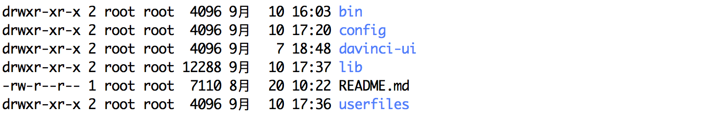

## 1 环境准备

- JDK 1.8（或更高版本）
- MySql5.5（或更高版本）
- Mail Server
- [Chrome](https://chromedriver.chromium.org/)（需同时安装chromedriver，清注意版本）
- Redis（可选）

## 2 配置部署

### 2.1 初始化目录

将下载好的 Davinci 包（Release 包，不是 Source 包）解压到某个系统目录，如：~/app/davinci

```bash
cd ~/app/davinci
unzip davinci-assembly_3.0.1-0.3.0-SNAPSHOT-dist.zip
```

解压后目录结构如下图所示：



### 2.2 配置环境变量

将上述解压后的目录配置到环境变量 DAVINCI3_HOME

```bash
export DAVINCI3_HOME=~/app/davinci/davinci-assembly_3.0.1-0.3.0-SNAPSHOT-dist
```

### 2.3 初始化数据库

修改 bin 目录下 initdb.sh 中要的数据库信息为要初始化的数据库，如 davinci0.3

```bash
mysql -P 3306 -h localhost -u root -proot davinci0.3 < $DAVINCI3_HOME/bin/davinci.sql
```

运行脚本初始化数据库（注：由于 Davinci 系统数据库中包含存储过程，请务必在创建数据库时赋予执行权限）

```bash
sh bin/initdb.sh
```

### 2.4 初始化配置

Davinci 的配置主要包括：server、datasource、mail、chrome、cache 等配置

进入`config`目录，将`application.yml.example`重命名为`application.yml`
后开始配置

```bash
cd config
mv application.yml.example application.yml
```

<b style="color: red">注意：由于 Davinci 使用 ymal 作为应用配置文件格式，请务必确保每个配置项键后的冒号和值之间至少有一个空格</b>

#### 2.4.1 server 配置

```yaml
server:
  protocol: http
  address: 127.0.0.1
  port: 8080

  access:
    address: 192.168.1.1
    port: 80
```

server 配置如上示例所示，`server.access.address`和`server.access.port`表示真实访问地址和端口，默认不开启，其值默认为`server.address`和`server.port`

如你在虚拟主机上部署 Davinci，启动端口为`8080`，该主机真实访问IP地址为`192.168.1.1`，你将虚拟主机的`8080`端口映射到`80`端口，则需打开 access 配置项，否则将不能正常使用 Davinci 的部分功能，如激活账号、下载、分享等

#### 2.4.2 datasource 配置

这里的 datasource 配置指 Davinci 系统的数据源，配置如下：

```yaml
spring:
  datasource:
    url: jdbc:mysql://localhost:3306/davinci0.3?useUnicode=true&characterEncoding=UTF-8&zeroDateTimeBehavior=convertToNull&allowMultiQueries=true
    username: root
    password: root
    driver-class-name: com.mysql.jdbc.Driver
    initial-size: 2
    min-idle: 1
    max-wait: 60000
    max-active: 10
```

将上一步初始化的数据库地址配置到`url`中，url 中的参数不要做任何修改，然后修改正确的数据库访问用户和密码即`username`和`password`

`initial-size`、`min-idle`、`max-wait`、`max-active`是连接池参数，具体属性请参考[DruidDataSource配置属性列表](https://github.com/alibaba/druid/wiki/DruidDataSource%E9%85%8D%E7%BD%AE%E5%B1%9E%E6%80%A7%E5%88%97%E8%A1%A8)

#### 2.4.3 mail 配置

***注：Davinci 使用注册--邮件激活添加用户，所以 mail 配置是必不可少的，且 mail 配置出错率较高，请务必注意***

```yaml
spring:
  mail:
    host: smtp.****.com
    port: 25
    username: example@***.com
    fromAddress: 
    password: example_password
    nickname: Davinci
    
    properties:
      smtp:
        starttls:
          enable: true
          required: true
        auth: true
      mail:
        smtp:
          ssl:
            enable: false
            
```

mail 配置并不复杂，以上就是完整的 mail 配置了，`username`为邮箱地址，`password`邮箱服务密码，需要注意的是常见免费邮箱（如 163 邮箱、QQ 邮箱、gmail 等）这里应填客户端独立密码，可前往对应邮箱账号设置页面开启 SMTP 服务，并申请客户端授权码（或独立密码，各邮箱提供商叫法不同）

`fromAddress` 为可选项，默认为 `username` 的值，其存在的意义在于部分邮箱服务可能在认证时 `username` 和 `addresss` 不同，这时需要配置 `fromAddress` 作为邮件真实发送地址，`username` 为连接邮箱服务认证使用

下表为常见免费邮箱 SMTP 服务地址及端口：


#### 2.4.4 截图配置

截图配置用于[定时任务](2.6-schedule)功能发送邮件正文中对可视化应用进行截图

```yaml
screenshot:
  default_browser: CHROME
  timeout_second: 600
  chromedriver_path: $your_chromedriver_path$
```
`default_browser` 为默认截图浏览器，目前仅支持 `CHROME`

**注意：`chromedriver_path` 需配置 Chromedriver （非Chrome）可执行文件绝对地址**

#### 2.4.5 cache 配置（可选）

cache 这里用 redis 作为缓存服务，配置如下：

```yaml
spring:
  redis:
    isEnable: false
    host: 10.143.131.119
    port: 6379
    
  #  cluster:
  #       nodes:

    password:
    database: 0
    timeout: 1000
    jedis:
      pool:
        max-active: 8
        max-wait: 1
        max-idle: 8
        min-idle: 0
```

如果要开启 cache 服务，请将`isEnable`设为`true`，并要设置相关配置（单机方式请打开`host`和`port`，集群方式请打开`cluster`配置项，二者只能选择一种）

由于 Davinci Cache 配置遵循 Spring 配置, 所以 Redis 配置除 `isEnable` 外，不必拘泥以上配置格式，如通过 `sentinel` 方式连接

#### 2.4.6 LDAP配置与实现（可选）

LDAP 配置项如下：

```yaml
spring:
  ldap:
    urls: 
    username: 
    password: 
    base: 
    domainName: 
```

除`domainName`需配置企业邮箱后缀外，其他配置项遵循[`SpringBoot`关于LDAP的配置](https://docs.spring.io/spring-boot/docs/current/reference/html/spring-boot-features.html#boot-features-ldap)， 需要注意的是，由于各组织、公司 LDAP 服务字段、域都不尽相同，如需对接 LDAP， 需自行修改源码打包使用，具体修改文件为：
`server/src/main/java/edp/davinci/service/impl/LdapServiceImpl.java`，只需修改`findByUsername`方法中关于 LDAP 相关字段即可。

#### 2.4.7 OAuth2配置（可选）

```yaml
security:
    oauth2:
      enable: false
      client:
        registration:
          cas:
            provider: cas
            client-id: "xxxxx"
            client-name: "Sign in with XXX"
            client-secret: "xxxxx"
            authorization-grant-type: authorization_code
            client-authentication-method: post
            redirect-uri-template: "{baseUrl}/login/oauth2/code/{registrationId}"
            scope: userinfo
        provider:
          cas:
            authorization-uri: https://cas.xxxxx.cn/cas/oauth2.0/authorize
            token-uri: https://cas.xxxxx.cn/cas/oauth2.0/accessToken
            user-info-uri: https://cas.xxxxx.cn/cas/oauth2.0/profile
            user-name-attribute: id
            userMapping:
              email: "attributes.Email"
              name: "attributes.CnName1"
              avatar: "attributes.Avatar"
```

oauth2配置如上示例所示，已cas endpoint为例

security.oauth2.enable设置为true表示启用oauth2

security.oauth2.client.registration.cas.client-id表示客户端id

security.oauth2.client.registration.cas.client-secret表示客户端密钥

security.oauth2.client.registration.cas.authorization-grant-type表示客户端授权方式，authorization_code表示授权码模式

security.oauth2.client.registration.cas.redirect-uri-template表示重定向地址

security.oauth2.client.registration.cas.scope表示访问请求范围

security.oauth2.client.provider.cas.authorization-uri表示授权服务器地址

security.oauth2.client.provider.cas.token-uri表示授权服务器的令牌端点URI

security.oauth2.client.provider.cas.user-info-uri表示UserInfo端点URI

security.oauth2.client.provider.cas.user-name-attribute表示UserInfo响应中返回的属性的名称

security.oauth2.client.provider.cas.userMapping表示用户信息字段映射关系，根据返回的用户的用户信息，获取对应字段的值

security.oauth2.client.provider.cas.userMapping.email表示用户信息的email字段，取值路径为attributes.Email，用户需要根据授权服务器的实际返回自行调整

security.oauth2.client.provider.cas.userMapping.name表示用户信息的name字段，取值路径为attributes.CnName1，用户需要根据授权服务器的实际返回自行调整

security.oauth2.client.provider.cas.userMapping.avatar表示用户信息的name字段，取值路径为attributes.Avatar，用户需要根据授权服务器的实际返回自行调整

#### 2.4.8 使用统计配置

[使用统计](4.1-statistic)开启后将记录可视化应用的使用数据和登录终端信息

```yaml
statistic:
  enable: false
  # You can use external elasticsearch storage [127.0.0.1:9300], default davinci datasouce
  elastic_urls:
  elastic_index_prefix:
```

如果要开启使用统计，请将`enable`设为`true`。统计数据默认情况下会存储到 Davinci 自身使用的 mysql 数据库中，也可以选择存储到 ElasticSearch 中

#### 2.4.9 数据源信息加密配置（可选）

```yaml
encryption:
  maxEncryptSize: 1024
  type: Off # Off is to turn off encryption, to enable encryption, please select AES or RSA
```

数据源密码支持加密存储，启用步骤如下：

1. 运行 `SourcePasswordEncryptUtils` 的 `main` 方法，会在 `userfiles` 目录下生成三个密钥文件 `${DAVINCI3_HOME}/userfiles/AES/private.txt` (对称加密密钥)，`${DAVINCI3_HOME}/userfiles/RSA/private.txt` (非对称加密私钥)，`${DAVINCI3_HOME}/userfiles/RSA/public.txt` (非对称加密公钥)。生成以后请务必进行备份，以免由于密钥丢失导致系统无法正确的加解密。

2. 修改 `${DAVINCI3_HOME}/config/application.yml` 中的 `encryption.type` 为 AES 或 RSA，根据实际情况选择

3. `encryption.maxEncryptSize` 为最大加密长度，`encryption.type` 为 RSA 时有效，根据实际情况调整

#### 2.4.10 其他配置

日志配置文件为`config/logback.xml`，如当前的日志配置不能满足你的要求，可自定义配置日志模式

## 3 数据源配置

Davinci 理论上支持所有有 JDBC 的数据源，我们默认支持的数据源有：

| 数据源名称    | 驱动类                                                |
| ------------- | ----------------------------------------------------- |
| mysql         | com.mysql.jdbc.Driver                                 |
| oracle        | oracle.jdbc.driver.OracleDriver                       |
| sqlserver     | com.microsoft.sqlserver.jdbc.SQLServerDriver          |
| h2            | org.h2.Driver                                         |
| phoenix       | org.apache.phoenix.jdbc.PhoenixDriver                 |
| mongodb       | mongodb.jdbc.MongoDriver                              |
| elasticSearch | --                                                    |
| presto        | com.facebook.presto.jdbc.PrestoDriver                 |
| moonbox       | moonbox.jdbc.MbDriver                                 |
| cassandra     | com.github.adejanovski.cassandra.jdbc.CassandraDriver |
| clickhouse    | ru.yandex.clickhouse.ClickHouseDriver                 |
| kylin         | org.apache.kylin.jdbc.Driver                          |
| vertica       | com.vertica.jdbc.Driver                               |
| hana          | com.sap.db.jdbc.Driver                                |
| impala        | com.cloudera.impala.jdbc41.Driver                     |

**注意：**

1. Davinci 内部只提供了 MySql 的驱动包，也就是说，如果你要使用其他数据源，还需将对应驱动jar 包手动拷贝到`lib`目录并重新启动 Davinci 服务  

2. 如果你的数据源不在以上列表中，也可以通过[自定义配置注入数据源](1.1-deployment#31-自定义数据源)，否则没必要开启，除非你知道在做什么

3. 关于 ElasticSearch 数据源的配置情况说明：

    Davinci 默认提供了 [NLPchina提供的elasticsearch-sql(version: 5.3.2)](https://github.com/NLPchina/elasticsearch-sql/tree/elastic5.3.2) 驱动，其强依赖 [Druid(version: 1.0.15)](https://github.com/alibaba/druid/tree/1.0.15)，所以为了避免 Druid 版本冲突，我们建议你在连接 ElasticSearch 时使用版本隔离的方式进行连接，具体请参考[多版本隔离配置](1.1-deployment#32-多版本隔离)，你可以根据你的 ES 服务自由选择驱动版本和 Druid 版本，甚至非 NLPChina 提供且**支持 JDBC 的**驱动包

    使用 NLPchina 提供的驱动包需要确认包含以下依赖文件 `elasticsearch-xxx.jar`、`transport-xxx.jar`、`x-pack-api-xxx.jar`、`x-pack-transport-xxx.jar`、`elasticsearch-sql-XXX.jar`（`xxx`表示你的 ElasticSearch 版本号，`XXX`表示 NLPchina 对应 elasticsearch-sql 版本号）

4. 关于 Mongo 数据源的配置情况说明：

    由于 MongoDB 官方提供的驱动包没有 Driver 类，需自行查找相应驱动包，目前 Davinci 默认指定的 Mongo 连接方式为（未提供驱动 jar 包）：

    ```yaml
    mongo:
      name: mongo
      desc: mongodb
      version:
      driver: mongodb.jdbc.MongoDriver
      keyword_prefix: \`
      keyword_suffix: \`
      alias_prefix: \"
      alias_suffix: \"
    ``` 

    jdbc url 以 `jdbc:mongo://` 开头，如果不符合你的需求，可通过配置[自定义数据源解决](1.1-deployment#31-自定义数据源)

### 3.1 自定义数据源

1. 打开自定义数据源配置文件

  ```bash
  mv datasource_driver.yml.example datasource_driver.yml
  ```

2. 如下配置你的数据源，这里以 postgresql 为例

  ```yaml
  postgresql:
    name: postgresql
    desc: postgresql
    version:
    driver: org.postgresql.Driver
    keyword_prefix:
    keyword_suffix:
    alias_prefix: \"
    alias_suffix: \"
  ```

  ***注意***

  - `keyword_prefix`和`keyword_suffix`表示关键字前缀和后缀，假设使用 mysql 数据库，并将`desc`关键字作为字段使用，那么你的查询语句应该是:

    ```select `desc` from table```
    这里的 ‘`’ 就是前后缀，它们必须成对被配置，可以都为空

  - `alias_prefix`和`alias_suffix`表示别名前后缀，仍以 mysql 为例，假设你的 sql 语句如下：

    ```select column as '列' from table```  

    这里为 ‘column’ 起了别名为‘列’，那么‘'’将作为前后缀配置，前后缀必须成对被配置，可以都为空

  - 对于以上别名配置，你可以使用`''`将字符包起来，也可以使用转义符`\`，二者只能出现一种

3. 手动将相应的驱动 jar 包拷贝到`lib`目录下

4. 重启 Davinci 服务

### 3.2 多版本隔离

如果你需要同时使用某个数据源的不同版本，需要以下配置：

1. 在 datasource_driver.yml 中新增数据源配置，使用 version 字段标记数据源对应版本。version 字段为空时，默认读取 `lib` 目录下的驱动文件。这里以 hive 为例
  ```yaml
  hive1.1.0:
    name: hive2
    desc: hive
    version: 1.1.0
    driver: org.apache.hive.jdbc.HiveDriver
    keyword_prefix: \` 
    keyword_suffix: \`
    alias_prefix: \`
    alias_suffix: \`
  ```

2. 在 lib/ext 下创建相应数据库及其版本目录（如无 ext 目录，可自行创建） 如：lib/ext/hive2/1.1.0

3. 将对应数据源的驱动包放入步骤2 创建的目录

4. 重启服务器

5. 在 source 新增或修改时选择数据源，详情参考 [数据源 - 新增数据源](2.1-source#1-新增数据源)

