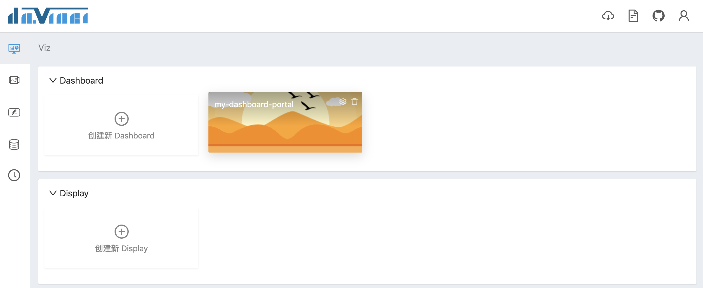
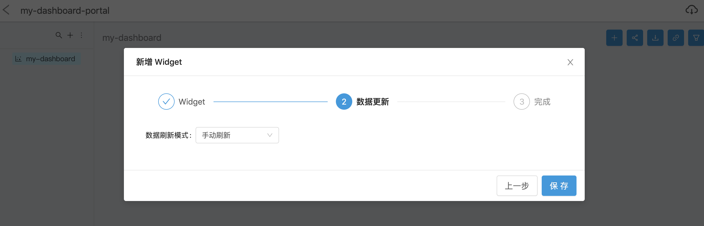
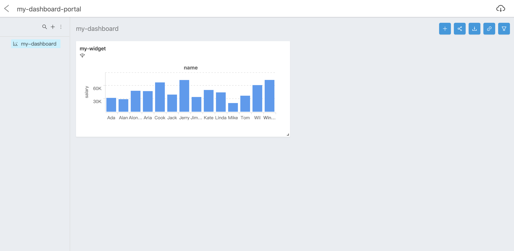

我们先来实现第一个应用。如果某一步不会操作，别担心，你可以到后面的章节中找对应的介绍

## 1 注册与登录

首先需要注册账号，注册前确保邮件服务器已正确配置，填写真实的邮箱地址，用于接收激活邮件，点击注册后，到对应的邮箱中激活即可进入系统

## 2 创建项目

首次登录成功后，系统会默认为你创建一个组织，你可以在该组织下创建项目

## 3 创建数据源

创建好项目之后，点击进入项目，先创建数据源

点击测试成功之后，保存数据源

## 4 创建数据视图

数据源创建成功之后，开始创建数据视图

在左侧选择刚才创建的数据源，写 SQL

执行成功后，下一步编辑数据模型

确认无误后，保存数据视图

## 5 创建可视化组件

数据视图创建成功之后，开始创建可视化组件

在左上角选择刚才创建的数据视图，加载出数据模型字段列表后，简单地拖拽两个字段到“数据”页签，并选择一个图表类型

保存可视化组件

## 6 创建可视化应用

可视化组件创建成功之后，开始创建可视化应用，点击“创建新 Dashboard”按钮创建仪表板门户

仪表板门户创建成功后，点击进入，在左侧菜单创建仪表板

仪表板创建成功后，点击仪表板左上角“+”按钮，将刚才创建的可视化组件添加进来

点击保存之后，就能在仪表板上看到刚才创建的可视化组件了

拽住可视化组件右下角稍作尺寸调整，第一个可视化应用就创建成功了！

点击 [下一页](2.1-source) 进一步了解功能详情