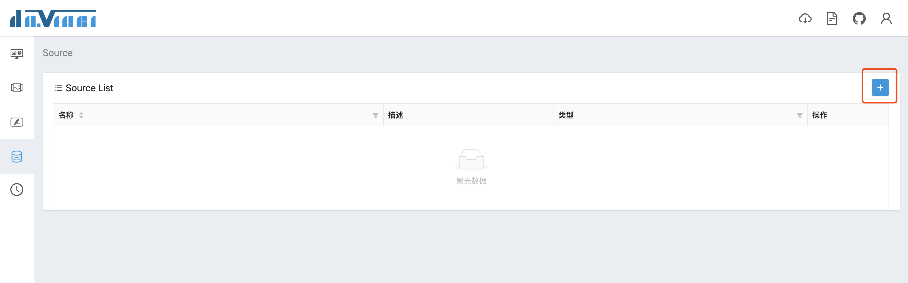
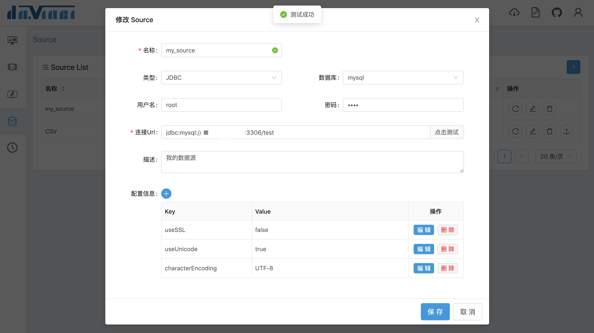
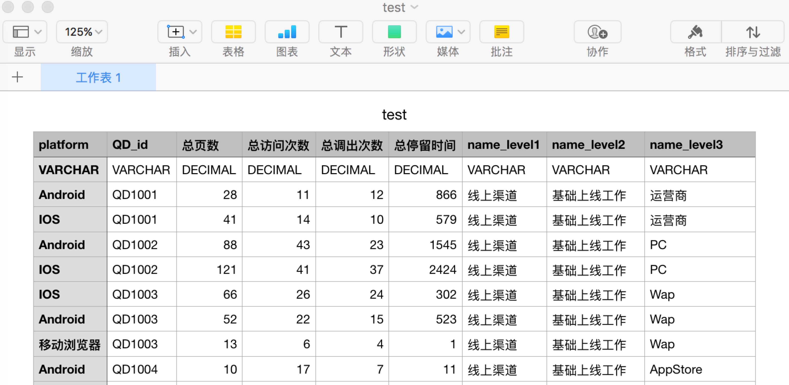
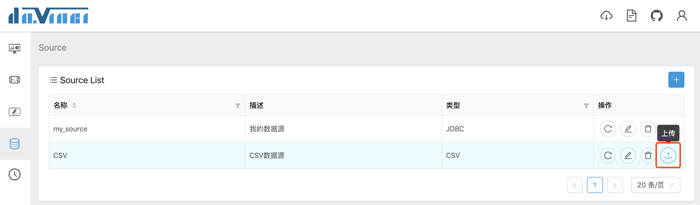
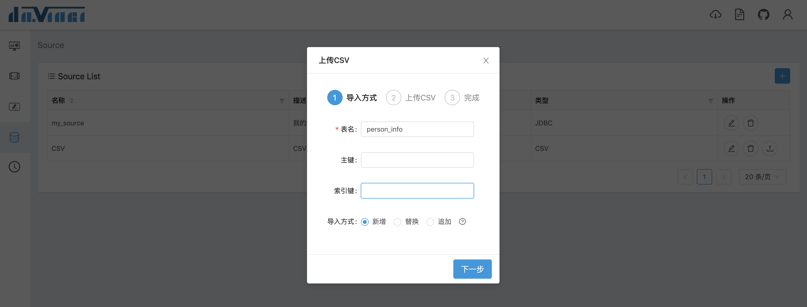
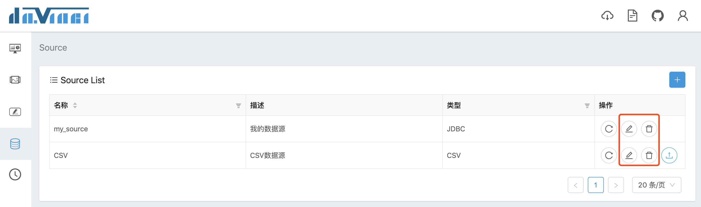
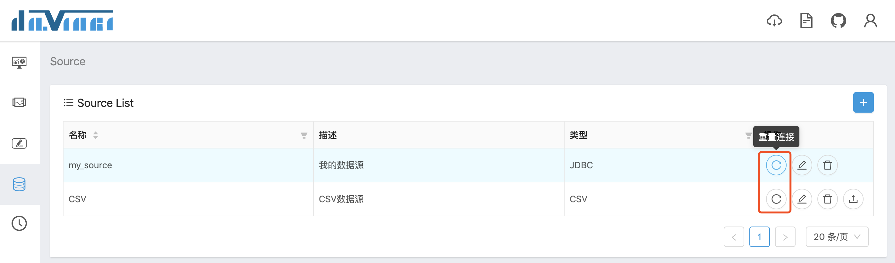

数据源（Source）用于管理用户数据源连接配置。Davinci 目前支持两种类型数据源：
1. 通过 JDBC 连接的数据源（配置详情参考 [安装 - 数据源配置](1.1-deployment#3-数据源配置)）；
1. 上传 CSV 文件到指定数据库中作为数据源

## 1 新增数据源

在数据源列表页，点击右上角“+”按钮弹出新增数据源表单



目前支持 JDBC 和 CSV 两种数据源类型；**需要注意，CSV 类型数据源也需要指定一个数据库来存储上传的 CSV 文件内容，目前仅支持 mysql 数据库**

数据库为可选项，当所选的数据源在服务器配置了多个版本的情况下，必须选择数据库及其版本号。选择数据库之后连接 Url 会自动填充前缀

用户名和密码为数据源连接账户及密码，连接 URL 请填写完整 JDBC 连接地址，通常格式为
```
jdbc:<数据源名称>://<数据源域名或IP>:(<端口>)/<数据源实例>(?<连接参数>)
```

其中端口和连接参数为可选项。部分数据源在写法上有少许差异，比如名称和域名/IP之间不需要 `//`、参数连接符使用 `;` 等等

配置信息栏填写连接参数，以键值对的形式，可根据不同数据源情况自行填写

在输入完上述内容之后，可以点击“点击测试”按钮检查数据源是否可以正常连接；测试成功并填写完毕之后，点击下方的保存按钮保存数据源配置

## 2 上传 CSV 文件数据

数据源添加完毕之后，如果是 CSV 类型数据源，下一步将准备上传 CSV 文件到数据库中

第一步，准备 CSV 文件，需要注意：
- 第一行为字段名称，建议使用英文
- 第二行为字段类型，使用大写字母
- 第三行之后为明细数据
- CSV 文件需要保存为 **UTF-8 格式**



第二步，点击“上传”按钮弹出配置表单



第三步，填写配置和上传 CSV 文件，其中表名为 CSV 文件内容在数据库中生成的表名称，主键和索引键为可选项，选择适当的导入方式

- 新增：在数据库中新建表并上传数据，当库中有相同名称表时会报错
- 替换：清空表原始数据并上传新数据
- 追加：在表原始数据基础上增量追加新数据
- 覆盖：重建表结构、清空表原始数据并上传新数据

其中“替换”和“覆盖”都会清空表原始数据，但区别在于，“替换”不改变表结构，“覆盖”会按照 CSV 文件中的字段信息重建表结构

最后，选择 CSV 文件，点击确定



## 3 编辑和删除数据源

在数据源列表中可以对现有的数据源进行编辑和删除操作


## 4 重置连接

Davinci 会在数据源连接断开之后自动尝试重连；当然，也可以在数据源列表页手动重新连接


