数据视图（View）用于管理用户编写的 SQL 模板，和对执行 SQL 后获取到的数据模型以及行列权限进行配置

## 1 SQL 编辑器

在数据视图列表页，点击右上角“+”按钮进入编辑器

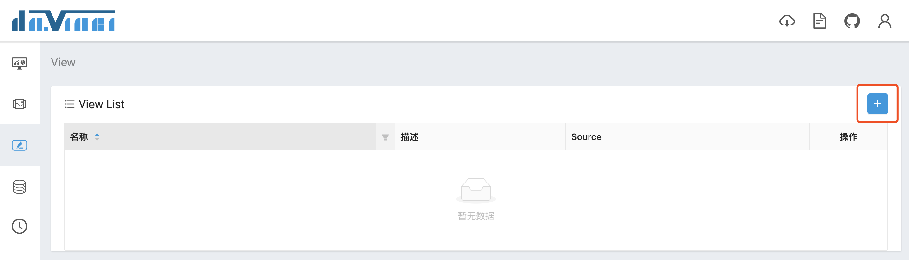

编辑器共分为4个区域：
- 左侧：数据源信息与数据视图表单

  数据视图表单包含名称、描述和关联数据源。当选择了关联数据源之后，下方的数据源信息会展示该数据源下的所有数据库；如果该数据源实例中只有一个数据库，会展示该数据库下的所有表。点击表名称前方的三角箭头会展示该表下的所有字段。通过上方的搜索框可以快速对数据库 / 表 / 字段信息做检索校对。目前数据源信息内容仅可以做预览校对作用

- 中上：SQL 编辑区

  编辑器会对以下内容自动提示：
  
  - 常用 SQL 关键字
  - 所选数据源的数据库 / 表 / 字段名称
  - 变量名称

- 中下：数据展示区

  展示 SQL 模板执行后获取的数据列表，默认展示 500 条预览数据，可配置

- 右侧：变量声明区

  管理 SQL 模板中使用的变量

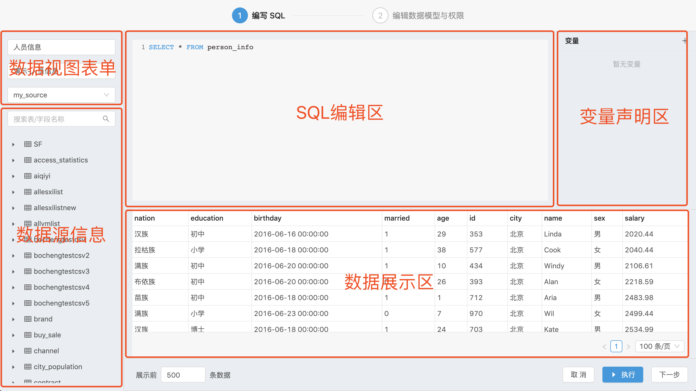

### 1.1 变量

变量提供了将 SQL 动态化的能力；Davinci 支持两种变量类型：查询变量和权限变量

点击变量声明区右上角的“+“弹出新增变量表单

#### 1.1.1 查询变量

查询变量通过与 Widget 和 Dashboard 中的控制器关联，起到动态变化 SQL 模板的作用

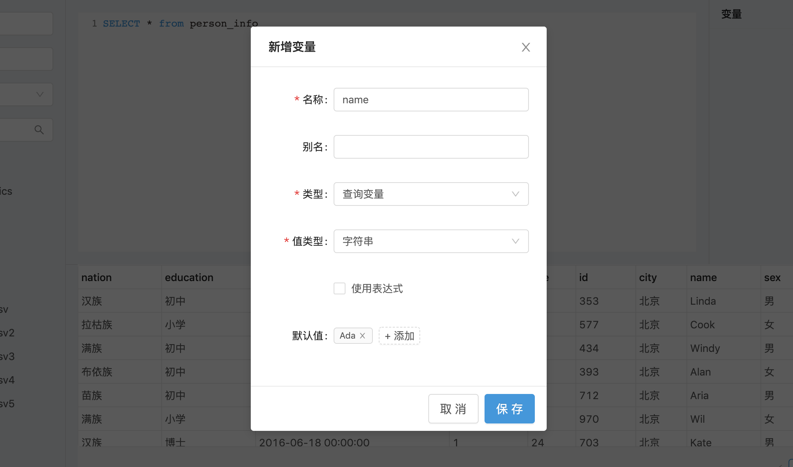

查询变量有字符串、数字、布尔、日期、SQL表达式共 5 种值类型，值类型是为了对用户输入的变量值做正确的处理之后注入到 SQL 模板，Davinci 会自动给字符串、日期类型的变量值加上引号

查询变量通常需要添加默认值以避免 SQL 执行错误，用户可以选择手动添加或使用表达式（SQL函数）作为默认值

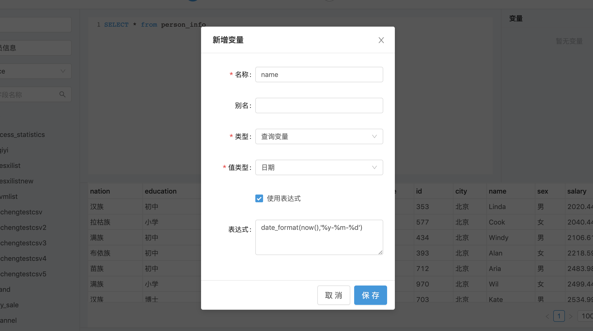

如果没有给查询变量添加默认值，可以参考 [条件语句](2.2-view#12-条件语句) 章节的写法避免 SQL 执行错误

填写完表单保存之后，就可以在 SQL 模板中使用 `$变量名称$` 语法引入查询变量

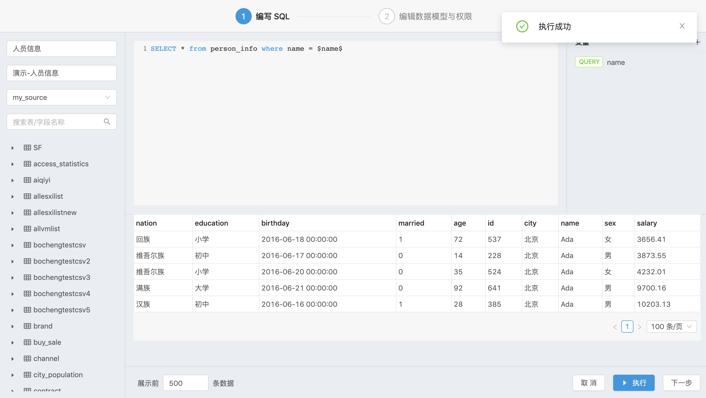

另外值得一说的是，Davinci 不会对 SQL 表达式类型的查询变量值做任何处理，所以理论上 SQL 表达式类型的查询变量值可以是任意 SQL 片段，用户可以通过与控制器搭配使用以达到非常灵活的效果

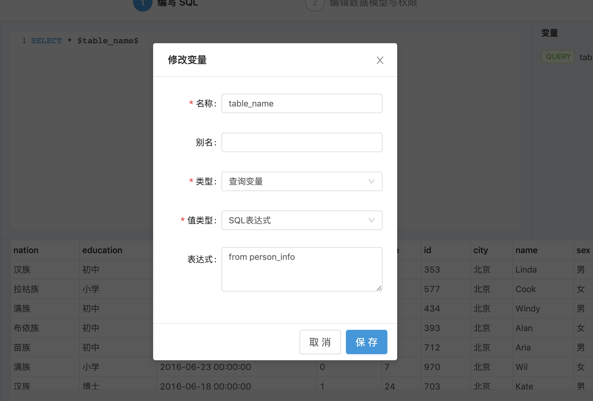
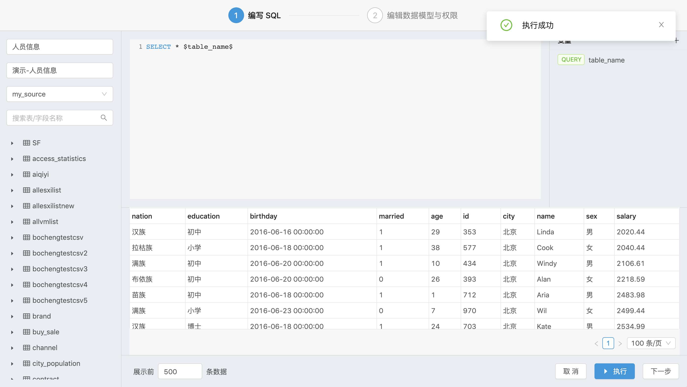

#### 1.1.2 权限变量

权限变量可以通过与角色关联，起到控制数据行权限的作用

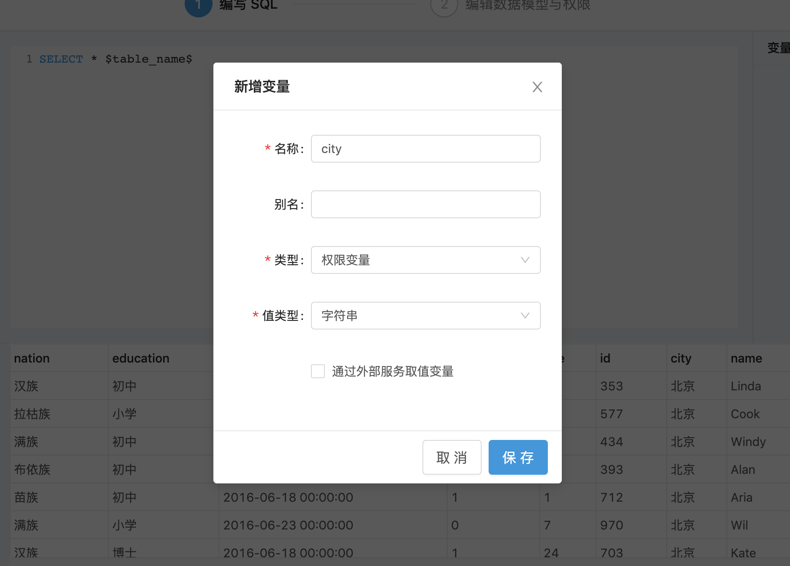

权限变量同样有字符串、数字、布尔、日期、SQL表达式共 5 种值类型。填写完表单保存之后，在 SQL 模板中使用 `(<字段> <运算符> $变量名称$)` 语法引入权限变量，**注意：权限变量所在的条件判断片段一定要使用小括号包裹**

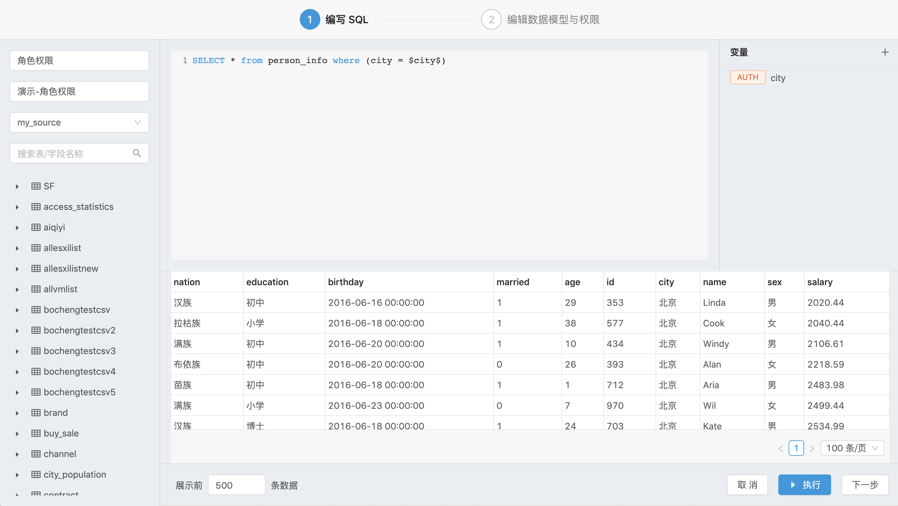

点击下一步，在 Auth 页签里管理项目所关联角色与权限变量的对应关系。当复选框未被勾选时，意味着该权限变量对该角色不生效，那么对该角色来说 `(<字段> <运算符> $变量名称$)` 小括号内的条件判断片段会被替换为 `(1 = 1)`；当复选框被勾选后，权限变量对该角色将会应用用户添加的值。单个权限变量可以添加多个值。

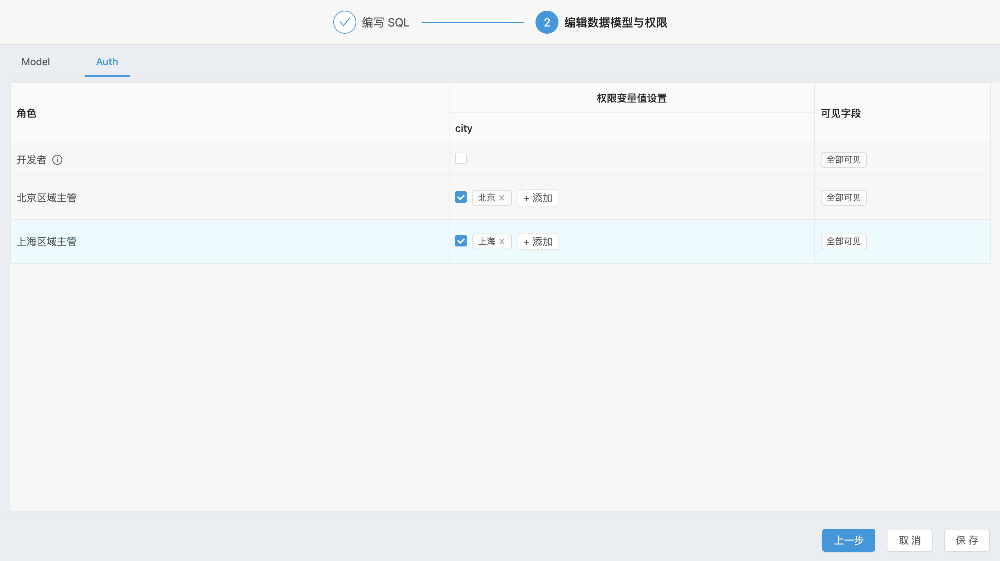

#### 1.1.3 系统变量

系统变量用于做用户粒度权限控制，Davinci 内置了以下5个系统变量
- $DAVINCI.USER.ID$：登录用户ID
- $DAVINCI.USER.NAME$：登录用户姓名
- $DAVINCI.USER.USERNAME$：登录用户用户名
- $DAVINCI.USER.EMAIL$：登录用户邮箱
- $DAVINCI.USER.DEPARTMENT$：登录用户部门

在 dashboard 和 display 中获取数据时，系统变量会替换为登录用户的相关信息。系统变量对组织拥有者和项目管理员不生效。

### 1.2 条件语句

SQL 模板支持简单的条件语句结合变量一起使用。Davinci 服务端使用 [StringTemplate](https://www.stringtemplate.org/) 对 SQL 模板进行解析，因此在条件语法上支持 `if...else...` 以及 `&& || !` 判断（不支持算数运算符，点击此处 [查看详情](https://github.com/antlr/stringtemplate4/blob/master/doc/templates.md#conditionals)）。如果对查询变量进行了条件判断，那么不设置默认值也不会报错。

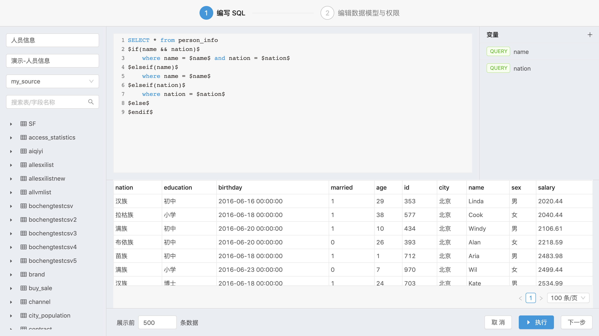

如果期望多个变量同时作用于过滤条件且互不影响，可以考虑如下写法

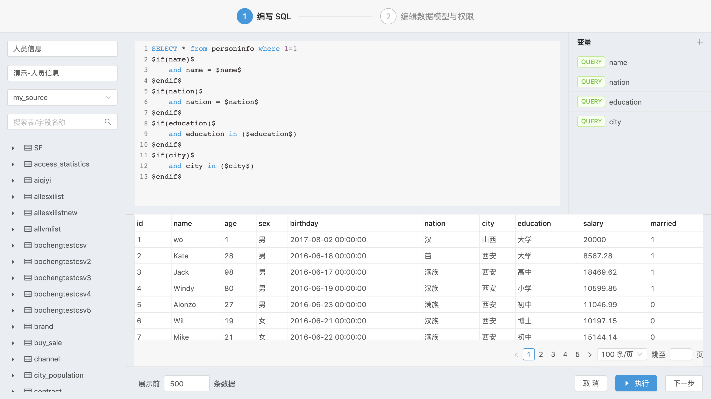

### 1.3 快捷操作

在 SQL 编辑区中，可以使用 `Command` + `Enter`（MacOS）`Ctrl` + `Enter`（Windows）组合键来快捷执行/中止 SQL。

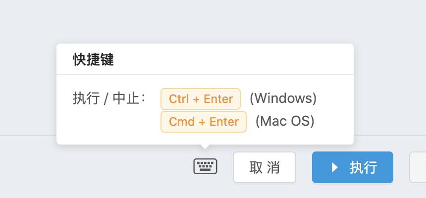

同时，也可以使用光标选择部分 SQL 语句执行。但仅执行部分 SQL 语句是无法点击下一步按钮的，必须执行完整 SQL 语句

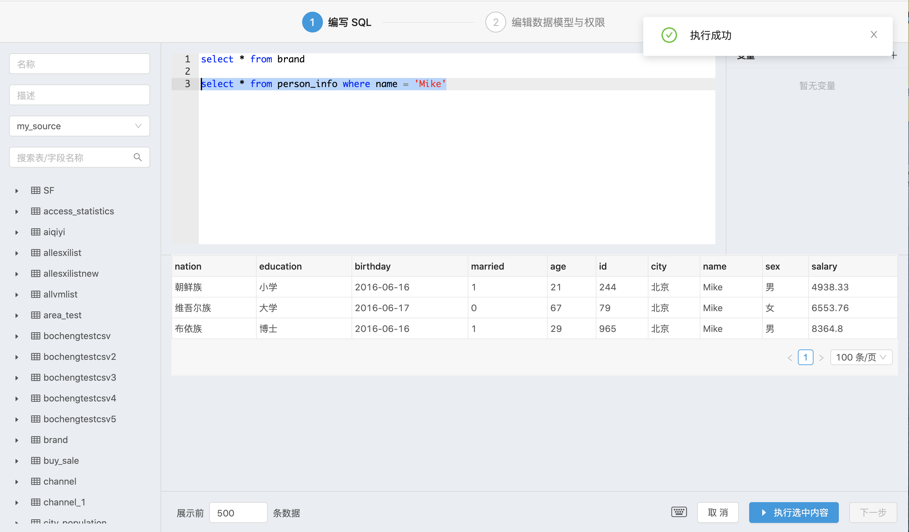

## 2 数据模型

数据模型是对数据视图中的数据进行提前归类，以便更好地进行可视化开发。在编写完 SQL 模板并成功执行之后，点击下一步，在 Model 页签中编辑数据模型

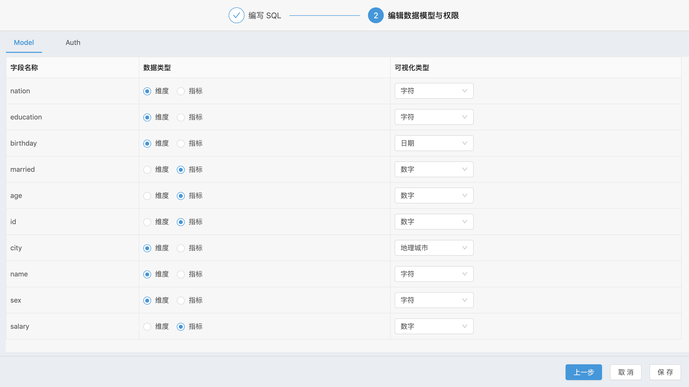

数据类型有维度和指标 2 种，用于可视化组件生成基本的可视化编码逻辑；可视化类型有字符、数字、日期、地理国家、地理省份、地理城市 6 种，用于字段格式设置、提示和地图显示。**如果准备在可视化组件中使用地图显示数据的话，请提前将对应的省份、城市字段标记可视化类型（目前仅支持中国地图），否则将无法正常显示**

Davinci 前端在拿到数据视图执行结果的 meta 信息之后会对字段的数据类型和可视化类型做预匹配，无法正确匹配的字段将会默认数据类型为维度、可视化类型为字符。人手原因我们很难将所有数据库的字段类型进行预置，所以欢迎大家贡献 [SQL_STRING_TYPES](https://github.com/edp963/davinci/blob/master/webapp/app/globalConstants.ts#L176)、[SQL_NUMBER_TYPES](https://github.com/edp963/davinci/blob/master/webapp/app/globalConstants.ts#L183)、[SQL_DATE_TYPES](https://github.com/edp963/davinci/blob/master/webapp/app/globalConstants.ts#L188)

## 3 行列权限

在 Auth 页签里可以配置项目所关联角色的数据行权限与列权限

### 3.1 行权限

在 [权限变量](2.2-view#112-权限变量) 章节中介绍了如何设置角色的数据行权限

### 3.2 列权限

通过点击“可见字段”列的标签会弹出字段列表，通过勾选来控制角色的数据列权限，默认全部可见。

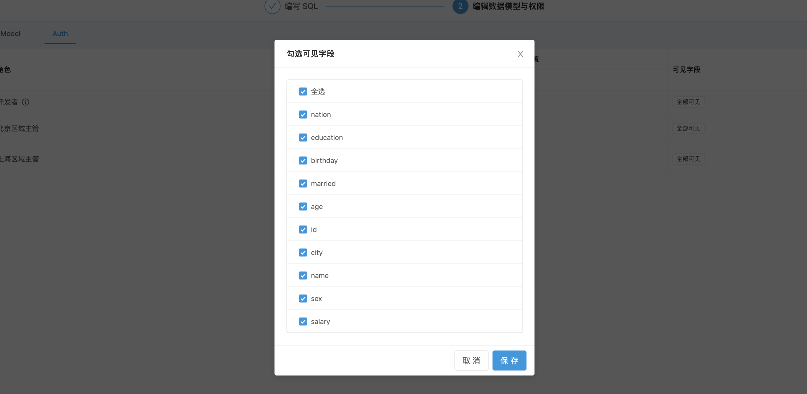
