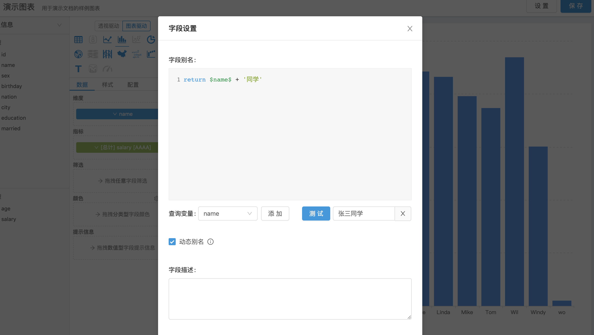
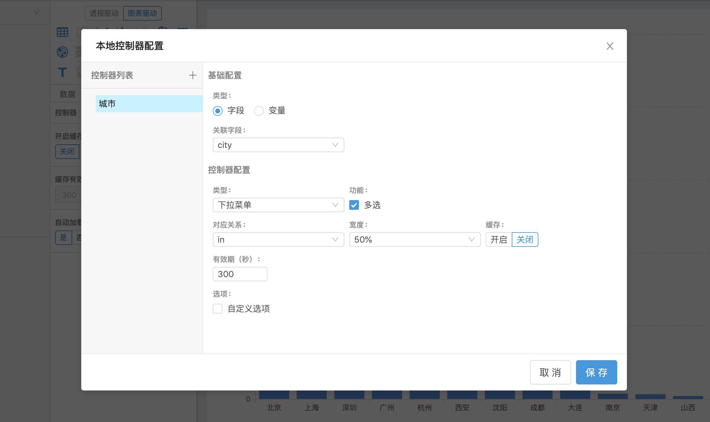

可视化组件（Widget）是 Davinci 打造可视化应用的最小单元。依据数据视图（View）提供的数据模型对SQL结果进行二次聚合分组，然后将二次加工的数据进行可视化编码。

## 1 设计原理

可视化组件编辑器通过将数据视图中的原始 SQL 语句与数据模型进行组合，生成新的 SQL 语句到数据库中执行，拿到图表展示所需要的数据

## 2 组件配置

在数据视图列表页，点击右上角“+”按钮进入编辑器

编辑器共分为3个区域：
- 左侧：数据模型展示区

  在左上角选择了对应的数据视图（View）之后，会将所选视图的模型分类展示在下方，维度字段展示在“分类型”列表中，指标字段展示在“数值型”列表中。用户可拖拽字段到图表配置区“数据”页签对应的区域中

- 中部：图表配置区

  顶部用于选择驱动模式与图表类型，将鼠标移动到图表类型图标上会提示使用该图表需要的维度和指标数量
  
  下方有3个页签：

  数据：用于添加图表所需的模型字段，用户通过拖拽数据模型展示区的字段来满足可视化展示需求

  样式：图表样式配置

  配置：功能性配置，如控制器、缓存

- 右侧：图表展示区

### 2.1 驱动模式

Davinci 支持两种可视化展示逻辑：透视驱动和图表驱动，用于支持不同的使用场景

#### 2.1.1 透视驱动

透视驱动是以[透视表](https://en.wikipedia.org/wiki/Pivot_table)为基础的可视化展示逻辑。图表可视为对透视表进行可视化编码，通过将透视表中的维度和指标转换为轴来做图形化展示。在透视驱动逻辑下，每个指标可以做不同的图形编码，在维度栏中最下层级的维度可以视为公用的维度轴

透视驱动适用于少量数据在客户端的自由分析场景

*目前透视驱动的配置项完善度不如图表驱动，我们会在未来逐步完善透视驱动的功能*

#### 2.1.2 图表驱动

图表驱动即为常规的、基于图表分类的可视化展示逻辑。图表驱动下的图表种类要丰富很多，维度和指标可视为固定配置项，与其他的样式配置一同服务于图表。

图表驱动适用于大多数可视化展示场景

### 2.2 数据配置

用户需要拖拽数据模型展示区的字段到“数据”页签对应的区域中来完成图表展示所需的数据配置，字段可放置区域会高亮提示

#### 2.2.1 维度

维度区域只能放置分类型字段，会对拖入的字段在 SQL 中进行分组

#### 2.2.2 指标

指标区域只能放置数值型字段，会对拖入的字段在 SQL 中进行聚合，目前支持以下6种聚合函数：
1. 总计（sum）
1. 平均数（avg）
1. 计数（count）
1. 去重计数（count_distinct）
1. 最大值（max）
1. 最小值（min）

点击字段名称进行聚合函数选择

指标区域内的字段可以进行数值格式设置，目前支持以下格式：
1. 默认格式
1. 数值：可以设置小数位数、单位和启用千分位分隔符
1. 货币：可以设置小数位数、单位、启用千分位分隔符和前/后缀文本
1. 百分比：可以设置小数位数
1. 科学型：可以设置小数位数

#### 2.2.3 筛选
筛选区域支持任意类型字段，会对拖入的字段在 SQL 中进行条件过滤，支持固定值、条件和日期三种筛选方式
- 固定值筛选：界面左侧会陈列出所选字段的值列表（distinct），用户通过选择左侧的内容到右侧进行固定值筛选

- 条件筛选：用户可以在界面中自由配置所选字段的过滤条件，同时可以配置各个条件之间的“与”（and）“或”（or）关系，是最灵活的筛选方式

- 日期筛选：支持所选字段的动态和固定时间范围筛选

筛选区域中的字段会根据用户在数据视图中设置的可视化类型来选择性地展示对应的筛选方式
- 字符和地理位置：固定值筛选和条件筛选
- 数值：条件筛选
- 日期：日期筛选

#### 2.2.4 颜色

颜色区域目前只能放置一个分类型字段，会对拖入的字段在 SQL 中进行分组。在图表展示上会根据所选字段值进行系列分组，可以通过图例来查看各个系列

需要注意，诸如展示饼图时需要通过某个维度来进行分组，那么只需将这个字段拖拽到颜色区域即可

#### 2.2.5 其他

- 尺寸：用于散点图做节点大小编码，只能放置数值型字段，会对拖入的字段在 SQL 中进行聚合
- 提示信息：仅部分直角坐标系图表支持，只能放置数值型字段，会对拖入的字段在 SQL 中进行聚合
- 透视驱动下的图表标签需要拖拽字段指定，支持任意类型字段，会对拖入的分类型字段在 SQL 中进行分组、数值型字段在 SQL 中进行聚合
- 透视驱动下的散点图需要额外指定x轴指标，只能放置数值型字段，会对拖入的字段在 SQL 中进行聚合
- 图表驱动下的双Y轴图可以分别指定左右Y轴指标

#### 2.2.6 通用设置
##### 2.2.6.1 别名

点击字段名称，选“字段设置”项，可进行字段别名设置。支持固定别名和动态别名设置

动态别名通过编写 JavaScript 代码来生成，可以和变量一起使用，目前仅支持表格组件

内置了 JavaScript Moment 类库，可以结合变量动态生成日期别名

##### 2.2.6.2 描述

点击字段名称，选“字段设置”项，可进行字段描述设置，目前仅在图表驱动的表格里作用

##### 2.2.6.3 排序

点击字段名称，在“排序”项进行字段排序设置，目前支持：
1. 默认，即不排序
1. 升序，在 SQL 中以此字段升序
1. 降序，在 SQL 中以此字段降序
1. 自定义，仅分类型字段支持，用户可拖拽字段值决定展示顺序，**在浏览器端以用户自定义顺序排序**

### 2.3 图表配置

在选择完字段之后，可以点击图表配置区顶部的小图标来选择进行可视化编码的图表。鼠标移动到小图标上可以查看该图表展示的先决条件，当先决条件不满足时图标呈置灰状态且不可点击，满足后图标呈高亮状态，点击后右侧会展示图表

图表配置区下方“样式”页签中，用户可以对图表进行表单化配置，详情可以查看[图表配置](5.1-chart_config)附录

Davinci 中使用的图表主要来自[echarts](https://www.echartsjs.com/)

### 2.4 功能配置

图表配置区下方“配置”页签中，用户可以配置控制器、参考线、展示数据量、缓存以及是否自动加载数据

#### 2.4.1 控制器

组件控制器的配置过程和仪表板[全局控制器](2.4-dashboard#26-全局控制器)基本类似，除了不用关联图表；功能上也基本一致

在仪表板中添加带有控制器的组件之后，可以点击组件左上角按钮打开控制器面板，选择内容之后，点击面板右下角查询按钮进行查询。组件控制器与全局控制的过滤条件对组件叠加生效

#### 2.4.2 参考线

可以给部分直角坐标系图表设置参考线和参考区间，目前仅支持折线图、柱状图、散点图和双Y轴图

##### 2.4.2.1 参考线

参考线需要关联到1个指标，数值可以选择关联指标的最大值、最小值、平均值，也可以选择手动设置常量值

##### 2.4.2.2 参考区间

参考区间需要设置起始值和结束值，每个值分别需要关联1个指标，数值可以选择关联指标的最大值、最小值、平均值，也可以选择手动设置常量值

#### 2.4.3 展示数据量

用于限制图表展示数据量

#### 2.4.4 缓存

用户可以配置缓存的开启/关闭和有效期。开启缓存后，在可视化应用（Viz）中该组件首次查询会将结果存储到 redis 中，使用 SQL 语句作为 key。之后在缓存有效期内的、SQL 语句相同的查询将直接返回缓存结果，不再访问数据源

缓存功能需要[配置redis](1.1-deployment#245-cache-配置可选)之后才可以正常使用

#### 2.4.5 初始化加载

在有些查询压力较大的场景下，用户不希望在打开仪表板时组件立即加载数据，可以设置“自动加载数据”项为否，默认情况为是。

## 3 编辑器设置

点击编辑器右上角的设置按钮可以设置查询触发模式和多选拖拽

### 3.1 查询触发模式

默认为立即触发，即拖拽字段到数据页签后立即查询并刷新右侧图表。如果数据视图的查询时间较长，可以尝试设置查询触发模式为手动来缓解数据库压力；设置为手动之后，图表配置区中间会显示一个查询按钮，拖拽字段不再触发查询，需要点击按钮触发

### 3.2 多选拖拽

有些场景下表格需要展示10个以上字段，在这种情况下多选拖拽可以很好地辅助编辑者工作

