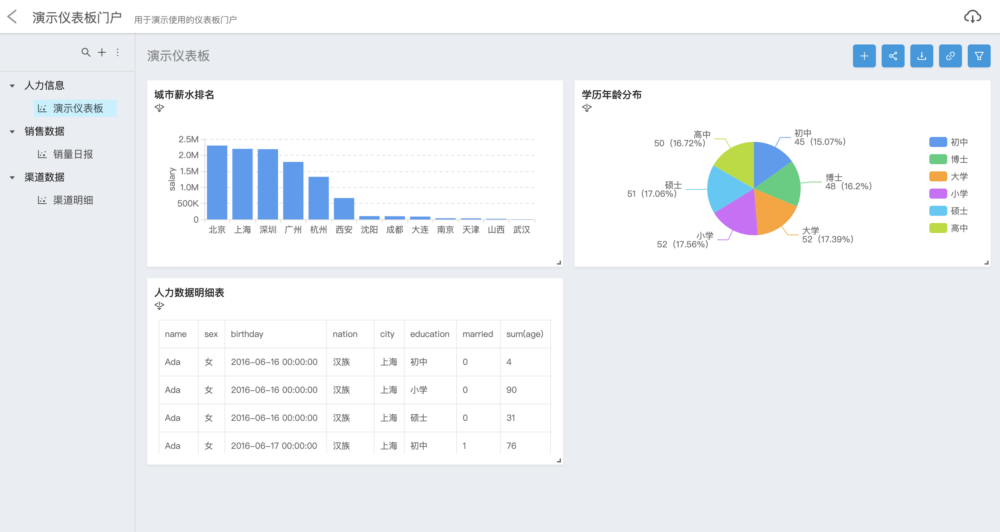
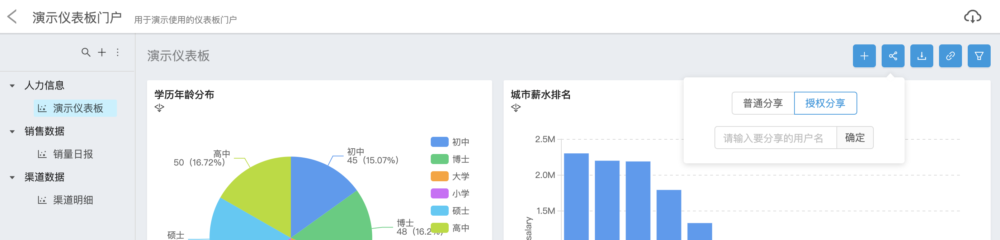
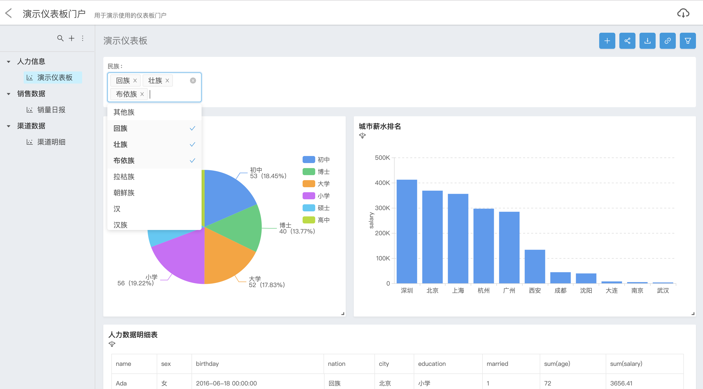

Davinci 提供了两个可视化应用（Viz），仪表板（Dashboard）是其中之一；仪表板提供自动布局和可交互能力，帮助用户快速打造可视化报表

## 1 仪表板门户

在可视化应用首页，点击“创建新 Dashboard”按钮来创建仪表板门户

制作中的仪表板门户可以选择“编辑”，这样对于[可视化应用模块只读权限的角色](3.4-project#32-权限设置)是不可见的

权限管理页签可以选择该仪表板门户对哪些[角色](3.3-role)可见

点击保存之后，可以看到刚才创建的仪表板门户卡片，编辑状态的仪表板门户卡片是置灰的；发布之后卡片会正常显示，卡片右上角有编辑和删除按钮

点击卡片进入门户，门户页分为左右两部分，左侧展示仪表板菜单树，点击菜单上的仪表板名称，在右侧展示仪表板

点击左侧上方的“+”按钮弹出新建表单，可以选择新建仪表板或文件夹；与仪表板门户一样，在“权限管理”页签可以选择该仪表板/文件夹对哪些角色可见

左侧菜单可以拖拽仪表板选择其所属文件夹；在仪表板数量较多的情况下还可以通过上方的搜索按钮快速定位仪表板

鼠标移动到菜单项上在右侧会显示扩展按钮，可以点击扩展按钮对仪表板/文件夹进行编辑、移动和删除操作

## 2 功能介绍
### 2.1 添加组件

点击仪表板右上角的“+”按钮，弹出可视化组件列表，选择需要添加到该仪表板上的组件

下一步中指定组件数据刷新模式，支持以下两种模式：
1. 手动刷新：通过点击组件右上角“同步数据”按钮更新数据
1. 定时刷新：根据所设置的更新时长定时自动轮询更新数据，时长单位为秒

点击保存按钮后组件会添加到仪表板上

### 2.2 自动布局

用户可以拽住组件右下角调整尺寸

可以拽住组件标题调整位置

在调整组件尺寸和位置时，其他组件会适应该组件变化进行流式布局

仪表板可视区域宽度在 768 像素以上时组件会按照用户定义的比例进行显示，在 768 像素以下时会响应为移动端观看模式

### 2.3 分享

分享功能有普通分享和授权分享两种，仪表板分享按钮在仪表板右上角左数第二个，组件分享按钮在组件右上角左数第四个

#### 2.3.1 普通分享

普通分享链接在点击分享按钮后会立即生成，在任意浏览器打开链接即可查看分享页。分享页在数据权限上与分享者保持一致。

#### 2.3.1 授权分享

授权分享需要指定一名 Davinci 用户，生成的分享链接有且仅有被指定者登录后才能查看

### 2.4 下载

用户可以下载仪表板和可视化组件的明细数据 Excel 文件；仪表板下载按钮在仪表板右上角左数第三个，组件下载按钮在组件右上角左数第五个。

当用户下载的仪表板中包含多个组件时，将分不同 sheet 页存储各个组件的明细数据

整个下载过程是异步的；点击下载按钮后，服务端生成下载任务，用户可以通过点击屏幕右上角云状按钮查看下载任务列表，当任务处理完毕之后，可以点击文件名称下载 Excel 文件

分享页下载流程也与上述一致

### 2.5 联动

仪表板中的组件之间可以配置联动关系，点击仪表板右上角左数第四个按钮打开配置面板

一个仪表板中可以配置多条联动关系，每条关系中包含一个触发器和一个联动图表，用户需要指定触发器与联动图表之间的字段对应关系

触发器只能选择图表所用到的字段，联动图表可以选择数据视图模型中的任意字段和变量；触发器与联动图表所选的字段类型必须一致

以下图为例，当添加了“学历年龄分布”组件作为触发器、其“education”字段作为输出条件，“城市薪水排名”作为联动图表、其“education”字段作为输入条件这样一条联动关系之后，点击“学历年龄分布”组件中的图表元素会根据输入的“education”内容对“城市薪水排名”中的数据做条件过滤

通过配置多条联动关系，可以支持一个触发器联动多个图表，也支持多个触发器联动一张图表、过滤条件叠加生效；在配置界面右侧的关系图中可以一览联动关系

作为联动触发器的组件左上角有操作提示

### 2.6 全局控制器

全局控制器能够支持用户对仪表板中的一个或多个组件做条件过滤或是变量输入；点击仪表板右上角最右侧按钮打开配置面板，面板左侧为控制器列表，右侧为配置表单

#### 2.6.1 配置

点击列表上方的“+”按钮添加控制器，默认名称为“新建控制器”。鼠标移动到控制器名称上时右侧会显示编辑名称和删除按钮

中上方选择控制器关联图表，勾选完之后在中下方选择关联字段及变量（必选）。当控制器关联字段时，控制器的输入内容将作为关联字段的过滤条件作用到 SQL 中；当控制器关联变量时，控制器的输入内容将替换变量作用于 SQL 模板中

右侧选择控制器类型和相关配置；控制器目前支持以下类型

##### 2.6.1.1 下拉菜单

下拉菜单控制器只能关联维度字段，下拉菜单选项即为关联字段的值列表（distinct）。当关联图表来源于不同数据视图时，下拉菜单选项为各个视图所关联字段值的并集。

关联变量时，下拉菜单选项也可以选择从字段取值

当选项从字段取值时，本质上也是通过执行数据视图中的 SQL 来取值，因此配置项中可以选择是否开启缓存和设置缓存有效期

如果下拉菜单选项不希望从字段取值，也可以自定义选项。在自定义选项面板中，每行定义一个选项，选项文本与选项值用空格分隔；如果文本与值相同可以只写一个

配置项中还支持多选配置；需要注意，关联变量时，多选选项最终会以诸如 `'选项1','选项2','选项3'` 的格式传递给变量，需要 SQL 语句改变为 `in ()` 语法来保证执行正确

##### 2.6.1.2 日期

日期控制器只能关联维度字段，支持将所选日期转换为以下格式：
- 日期（如 2019-01-01）
- 日期时间（如 2019-01-01 12:00:00）
- 日期时间分钟（如 2019-01-01 12:00）
- 月（如 2019-01）
- 周（如 2019-5周）
- 年（如 2019）

目前仅有日期控制器可以设置默认值，默认值支持动态日期或是指定日期

日期控制器同样支持多选配置，在多选的情况下，日期格式将只支持“日期”、“月”、“年”三种，默认值只能指定日期；与下列菜单一样，在关联变量时也需要注意 SQL 语法问题

##### 2.6.1.3 日期范围

日期范围控制器只能关联维度字段，支持格式与[日期控制器](2.4-dashboard#2612-日期)相同

在关联变量时，日期范围控制器必须关联两个变量，用于做起始时间与截止时间输入

##### 2.6.1.4 文本输入框

文本输入框控制器只能关联维度字段，在[立即查询模式](2.4-dashboard#264-查询模式)下需要敲回车键触发查询

##### 2.6.1.5 数字范围输入框

数字范围输入框控制器只能关联指标字段，在[立即查询模式](2.4-dashboard#264-查询模式)下需要敲回车键触发查询

在关联变量时，数字范围输入框控制器必须关联两个变量，用于做起始与截止数值输入

#### 2.6.2 级联

控制器之间可以通过拖拽的方式配置级联关系，当控制器之间为级联关系时，上级控制器的输入内容将作为下级控制器（下拉菜单）选项取值的过滤条件

#### 2.6.3 分享页参数传递

在分享页可以通过 URL 给全局控制器传递参数，具体格式如下

`<分享页URL>&<控制器名称>=<值>`

可以同时给多个控制器传参。控制器如预设了默认值会被参数值覆盖

#### 2.6.4 查询模式

配置界面左下角可选择查询模式，默认为立即查询，即控制器值发生变化后立即触发关联图表进行查询，文本输入框、数字范围输入框在立即查询模式下需要敲回车键触发查询

手动查询模式时，全局控制器栏右侧会显示查询和重置两个按钮，只有点击查询按钮时会触发查询

### 2.7 同步数据（更新缓存）

当可视化组件需要获取最新数据时，点击组件右上角左数第一个按钮可以触发查询；如果组件开启了缓存，点此按钮可以刷新缓存

### 2.8 全屏展示

点击组件右上角左数第三个按钮可打开全屏模式展示图表

### 2.9 自由钻取

仪表板中部分图表类型支持自由[钻取](https://en.wikipedia.org/wiki/Data_drilling)；Davinci 中自由钻取的基本逻辑是：先点击图表元素进行条件过滤，然后点击鼠标右键选择维度进行钻取

以下图为例，用户选择“上海”、“深圳”、“广州”三项图表元素，钻取到“education”字段，此时图表的展示逻辑是：上海、深圳、广州三个城市的教育程度与薪水分布图

可视化组件左下角会展示图表的钻取路径，用户可以选择之前任意一级路径返回

支持自由钻取的组件在左上角有操作提示

需要注意，作为[联动](2.4-dashboard#25-联动)触发器的图表将无法进行自由钻取操作

自由钻取在透视驱动与图表驱动模式下有一定的区别

#### 2.9.1 透视驱动

透视驱动下的自由钻取，是在条件过滤的基础上，在透视表中增加/减少维度来观察数据变化

在透视表中，可以选择钻取方式为上卷或下钻，上卷即为去掉该维度，下钻即为增加该维度；同时透视表中可以选择钻取到行或列

#### 2.9.2 图表驱动

在图表驱动下，表格的自由钻取逻辑与透视表类似；其他图表是在条件过滤的基础上，将钻取的维度对图表中现有维度进行替换，以另一个维度观察数据变化

目前图表驱动中支持自由钻取的图表类型有
- 表格
- 柱状图
- 折线图
- 散点图
- 饼图
- 漏斗图
- 双Y轴图

### 2.10 组件设置

需要编辑组件时，可点击组件右上角左数第二个按钮快捷进入组件编辑界面

点击组件右上角扩展按钮，可以修改组件数据刷新模式，和从仪表板中删除组件

