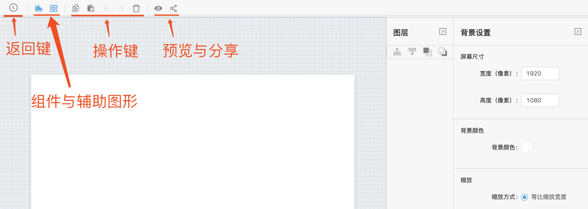
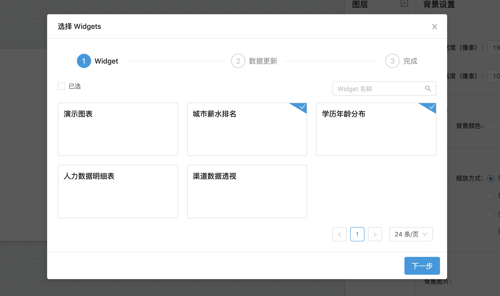
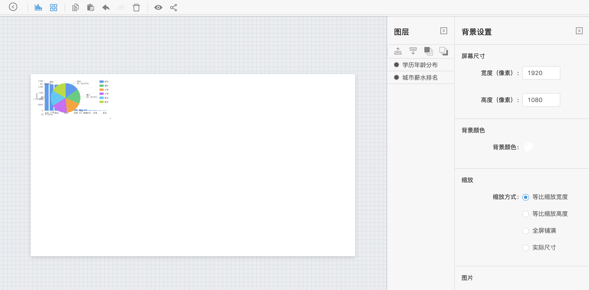
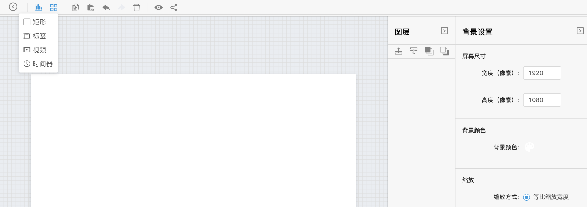
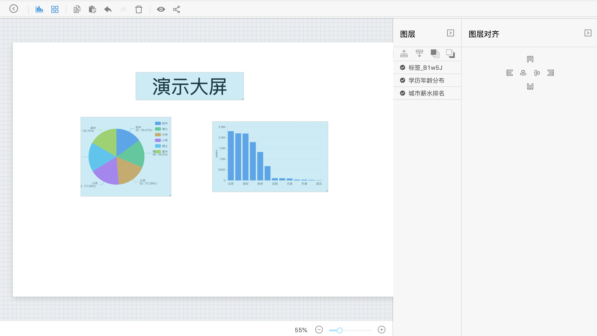

大屏（Display）是 Davinci 提供的第二个可视化应用，提供自由布局和自定义样式能力，通过可视化组件和一系列内置辅助图形来打造视觉呈现丰富的可视化大屏

大屏的定位与仪表板不一样，仪表板倾向于快速打造可视化报表，而大屏通常被广泛用于静置观看与演示的场景，因此大屏的制作过程通常需要比仪表板花更多的时间，需要用户准备素材（如背景图）来丰富大屏的样式

## 1 新建大屏

在可视化应用首页，点击“创建新 Display”按钮来创建大屏

与仪表板一样，制作中的大屏可以选择“编辑”，这样对于[可视化应用模块只读权限的角色](3.4-project#32-权限设置)是不可见的

权限管理页签可以选择该大屏对哪些[角色](3.3-role)可见

点击保存之后，可以看到刚才创建的大屏卡片，编辑状态的大屏卡片是置灰的；发布之后卡片会正常显示，卡片右上角有编辑、复制和删除按钮

## 2 编辑器

点击大屏卡片进入编辑器，编辑器顶部为工具栏，下方为编辑区；编辑区中包含画布、图层列表和配置表单

### 2.1 工具栏

工具栏共有4组按钮：
- 返回键：返回可视化应用首页
- 组件与辅助图形：选择要展示在画布中的组件和辅助图形
- 操作键：用于对画布图层的功能操作
- 预览与分享：打开预览页与生成分享链接

#### 2.1.1 添加组件

点击 Widgets 按钮会弹出可视化组件列表，点击组件卡片进行选择；在下一步中指定组件数据刷新模式，支持以下两种模式：
1. 手动刷新：通过点击组件右上角“同步数据”按钮更新数据
1. 定时刷新：根据所设置的更新时长定时自动轮询更新数据，时长单位为秒

点击保存按钮后，所选组件会添加到画布图层中

#### 2.1.2 添加辅助图形

点击辅助图形下拉列表，可以看到目前支持的4种辅助图形：
- 矩形：支持设置背景颜色、背景图片和边框，一般用于给组件做背景修饰
- 标签：支持输入文字、设置字体、边距、背景颜色和边框，一般用于做文字展示
- 视频：支持播放在线视频
- 时间器：展示一个动态变化的时钟

点击列表项即可添加辅助图形到画布中

#### 2.1.3 操作键

操作键包含复制、粘贴、撤销、前进、删除5个按钮，其中复制、粘贴和删除按钮支持多选图层后批量操作，编辑画布过程中，可随时点击撤销或前进来实现编辑的回滚和恢复

上述操作键同时也支持通过键盘快捷键控制，和我们平时使用的快捷键一致

| 功能 | Mac 快捷键 | Windows 快捷键 |
| - | - | - |
| 复制/粘贴 | `Cmd + C` / `Cmd + V` | `Ctrl + C`/ `Ctrl + V` |
| 删除 | `Delete` | Backspace |
| 撤销 | `Cmd + z` | `Ctrl + z` |
| 前进 | `Cmd + y` 或 `Shift + Cmd + z` | `Ctrl + y` |

#### 2.1.4 预览与分享

制作完成大屏之后，可以点击预览按钮进行预览；分享功能则与[仪表板分享](2.4-dashboard#23-分享)一致，有普通分享和授权分享

### 2.2 编辑区
#### 2.2.1 画布

组件和辅助图形添加到画布后可视为画布中的图层，用户可以在画布中通过拖拽编辑图层的尺寸和位置；为辅助对图层定位，在编辑图层时画布会显示相应的辅助线来帮助用户对齐图层

画布右下角的滑块可以对画布进行缩放，辅助用户编辑局部样式

在画布中按住 `Cmd` 或 `Alt` 键点击图层可以批量选中，然后进行复制、删除和对齐等操作

对于选中图层，可以使用键盘方向键对图层位置进行微调

另外对于画布中的组件，可以点击右上角的编辑按钮进入组件编辑界面

点击画布中的空白区域，可以去掉对图层的选中状态

#### 2.2.2 图层列表

用户可以在图层列表编辑以下操作：
- 选择图层：点击列表项可以让画布中的图层处于被选中状态
- 批量选中图层：按住 `Cmd` 或 `Alt` 键点击图层列表项可以批量选中图层
- 编辑图层 Z 轴位置：选择图层之后，可以点击图层列表顶部的按钮改变图层 Z 轴位置

#### 2.2.3 配置表单

默认状态下，配置表单中显示画布配置项，其中包括：
- 屏幕尺寸：用户可根据实际展示大屏设备设置画布尺寸
- 背景颜色
- 缩放方式：
  - 等比缩放宽度：画布宽度与显示终端宽度一致，高度等比缩放
  - 等比缩放高度：画布高度与显示终端高度一致，宽度等比缩放
  - 全屏铺满：画布宽、高皆与显示终端一致，此时画布有可能变形
  - 实际尺寸
- 背景图片
- 截取封面：截取画布作为大屏卡片背景图

在图层处于选中状态时，配置表单中显示图层配置项，其中包括：
- 尺寸
- 位置
- 背景色
- 边框
- 数据刷新模式
- 特有配置

在批量选中图层时，配置表单中显示图层对齐方式
