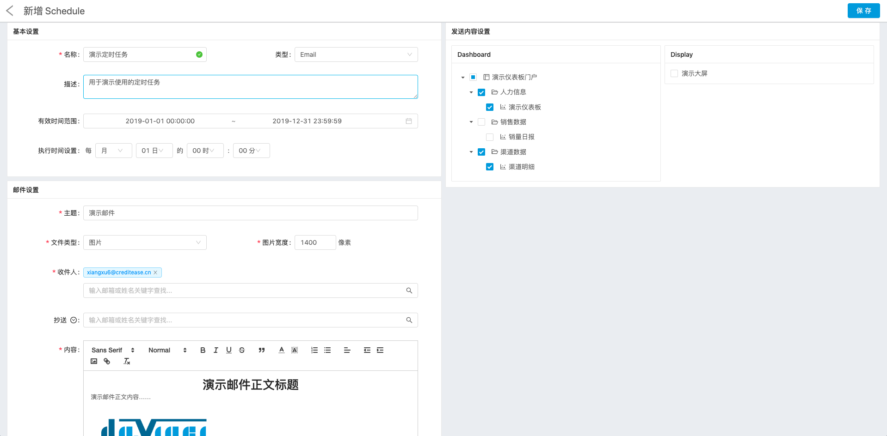
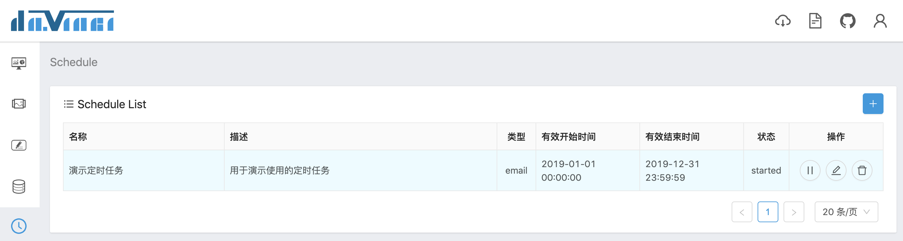

定时任务（Schedule）功能支持用户对已制作完成的可视化应用配置定时事件，目前仅支持邮件发送

邮件功能需要正确[配置邮箱](1.1-deployment#243-mail-配置)才能正常使用

## 1 新建定时任务

在定时任务列表页，点击右上角“+”按钮进入新建表单页

新建表单页分为3部分：
- 基本设置：任务名称、类型（仅 Email）、描述、定时任务生效时间范围和执行周期
- 邮件设置：
  - 邮件主题
  - 文件类型：
    - 图片：附件及邮件正文中添加所选仪表板/大屏截图，可以设置图片宽度，高度为自适应
    - Excel：附件中添加所选仪表板/大屏明细数据 Excel 文件，其中每个组件对应一个 sheet 页
    - 图片 + Excel
  - 收件人：支持多人，输入 Davinci 系统用户邮箱前缀时会有列表提示
  - 抄送、密送：支持多人
  - 内容：邮件正文，可富文本编辑，支持插入图片
- 发送内容设置：选择要在邮件中发送的仪表板/大屏，可多选

点击保存定时任务配置

## 2 执行定时任务

回到定时任务列表，可以看到刚创建的定时任务状态为“new”

点击操作列左数第一个按钮执行/暂停定时任务，

## 3 编辑和删除定时任务

操作列中还可以对定时任务进行编辑和删除操作，需要注意，执行中的定时任务无法编辑与删除
