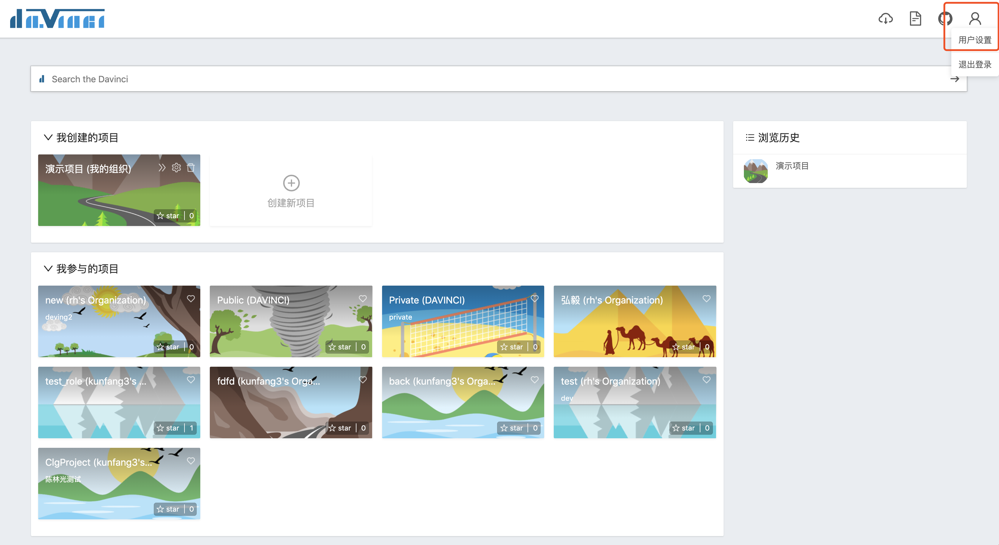
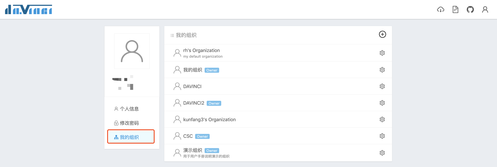
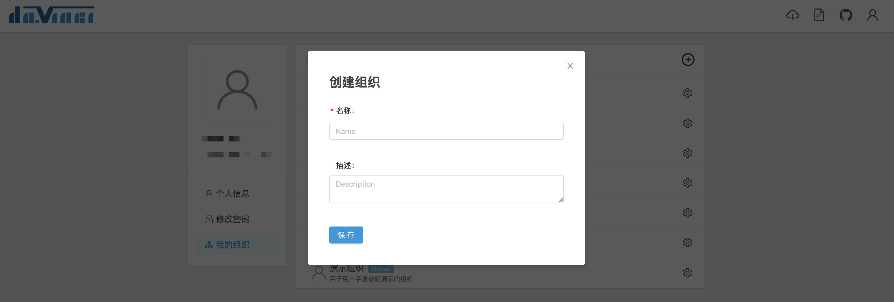
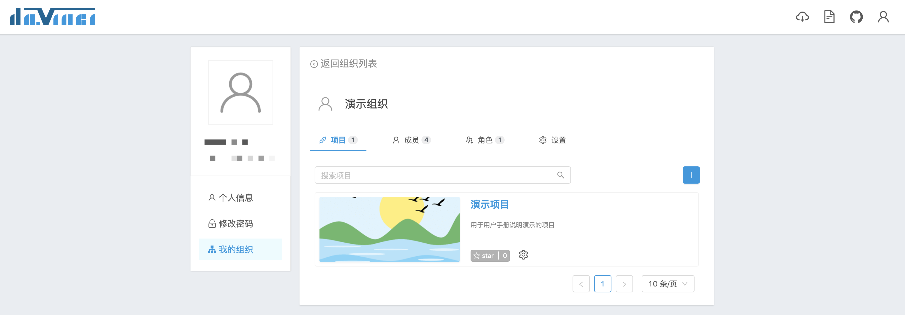
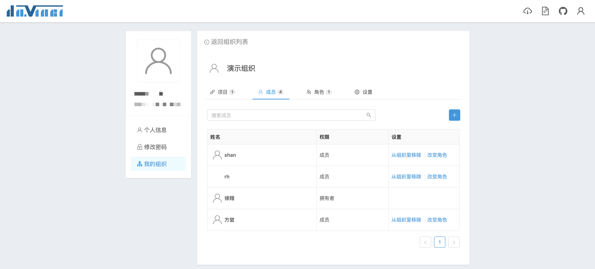
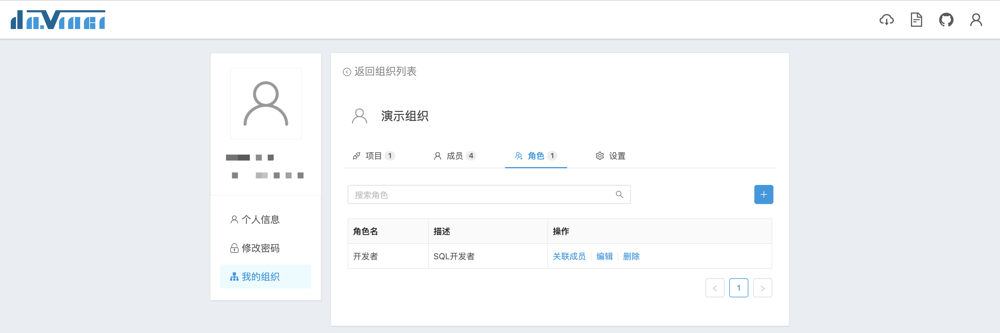
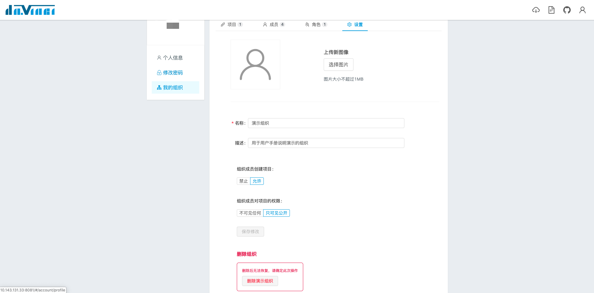

组织是 Davinci 多租户体系的基本单元。每个组织内可以创建多个项目和角色，可以邀请其他用户加入组织。组织内部通过项目（资源）/ 用户 / 角色构成基本的 [RBAC](https://en.wikipedia.org/wiki/Role-based_access_control) 模型来进行权限管理。每位 Davinci 用户都可以通过创建不同的组织来对不同的项目和用户进行管理。

点击导航栏右上角的用户图标 -> 用户设置进入个人页，点击左侧二级菜单“我的组织”即可进入组织列表页，用户创建的组织和受邀参与的组织都会显示在列表上。

## 1 创建组织

在组织列表页，点击右上角“+”按钮会弹出创建组织表单

创建成功之后，新创建的组织会显示在组织列表上；点击列表上的组织名称可以进入到组织详情页。

## 2 项目、成员与角色

组织详情页共有4个页签，分别是项目列表、成员列表、角色列表和设置页。

## 3 组织设置

在组织设置页，组织拥有者可以
- 更换组织图标
- 编辑组织名称和描述
- 设置成员创建项目权限
  - 当设为“禁止”时，普通成员不可以创建项目
- 设置成员对项目的可见权限
  - 当设为“之可见公开”时，普通成员可以看到公开项目和自己所在角色参与的授权项目
  - 当设为“不可见任何”时，普通成员只能看到自己所在角色参与的授权项目
- 删除组织

