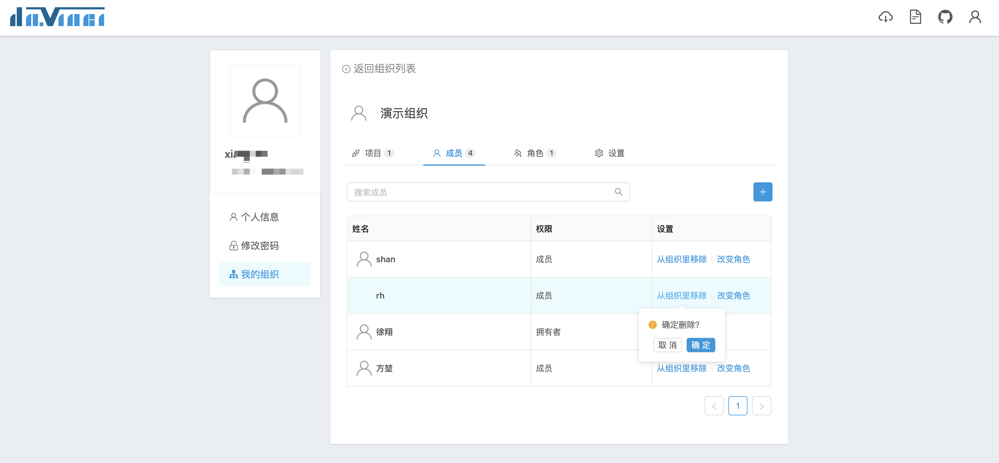
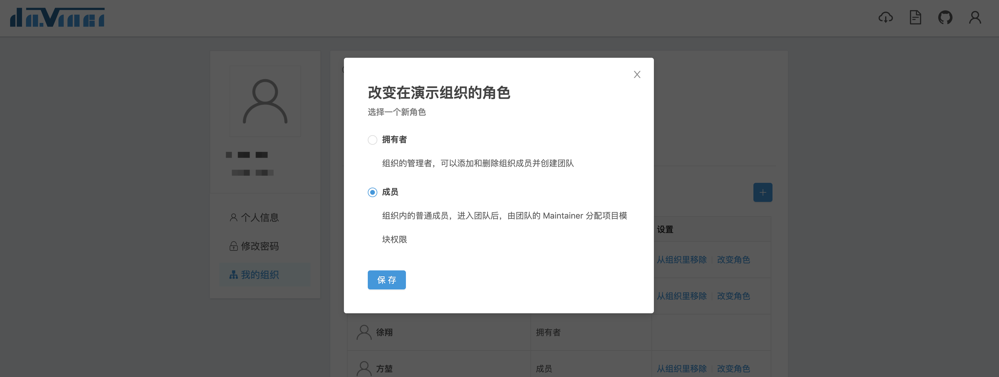

参与组织的用户都是组织成员。组织成员有两种类型：
- 拥有者：可视为组织管理员，拥有以下权限
  - 创建、编辑和删除项目
  - 邀请和移除成员，改变成员类型
  - 创建、编辑和删除角色，给成员关联角色
  - 给项目关联角色，分配角色在项目中的权限
  - 添加和移除项目管理员
  - 编辑组织设置
  - 默认拥有所有项目管理员权限
- 普通成员：
  - 在关联角色之后，拥有所关联角色在项目中的权限
  - 可以被指定为项目管理员，拥有所指定项目的最大权限

## 1 添加成员

在成员页签，点击右侧的“+”按钮弹出成员邀请框。**只能邀请已登录过的用户**加入组织，可输入用户名 / 邮箱 / 用户姓名进行搜索，可以选择是否需要邮件确认

点击“邀请成员”后，系统会发送邀请邮件到受邀用户邮箱，受邀用户需要点击邮箱中的确认按钮并登录确认。

## 2 成员设置

普通成员可以查看组织中其他成员的角色列表

组织拥有者可以改变成员类型和移除成员

