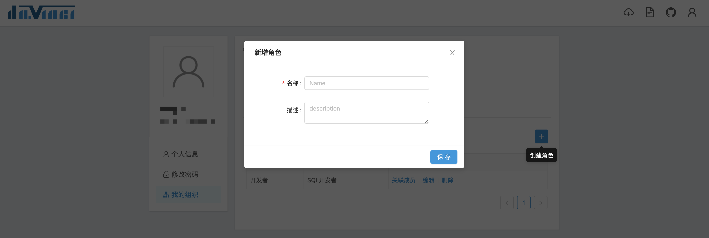
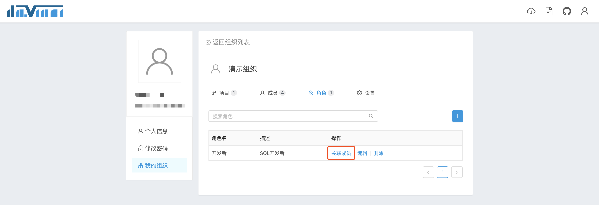
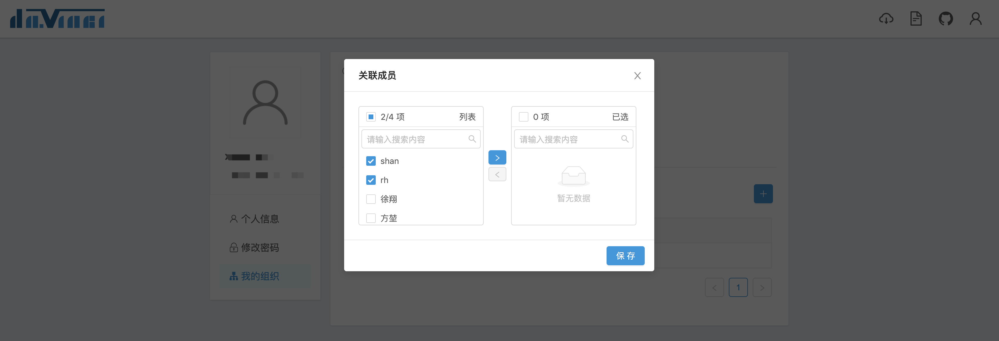
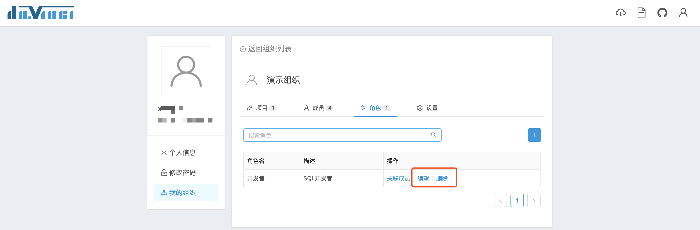

一个组织内可以创建多个角色，用户可以按照自己的习惯给角色赋予意义，当角色与项目进行关联之后，便可以设置该角色在该项目中的功能权限与可视化权限；同时，与此角色关联的用户在项目里将拥有该角色的权限。

如果同一个用户关联了多个角色，在一个项目中又同时关联了这多个角色，那么用户在该项目中拥有权限将是这多个角色权限的并集。

## 1 添加角色

点击角色页签右侧的“+”按钮弹出创建角色表单

## 2 关联成员

点击列表操作栏中“关联成员”弹出关联成员穿梭框，移动到穿梭框右侧的成员在保存后将与该角色进行关联

## 3 角色设置
组织拥有者可以编辑和删除角色

