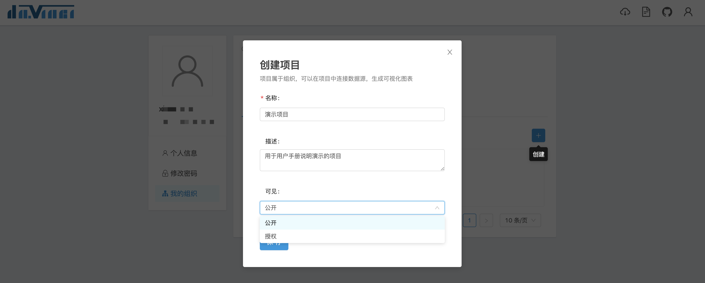
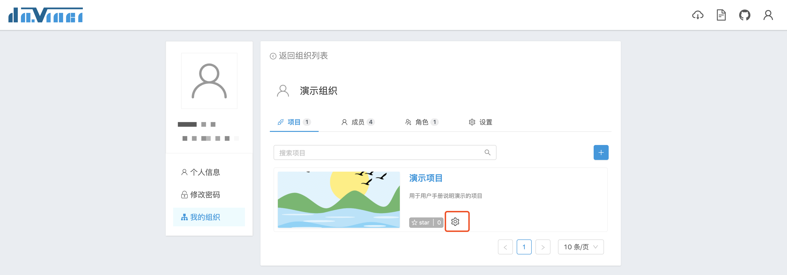
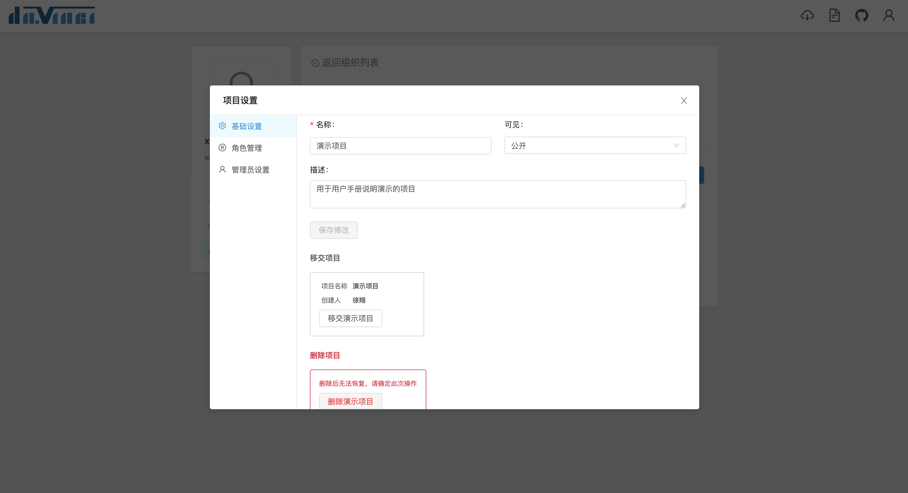
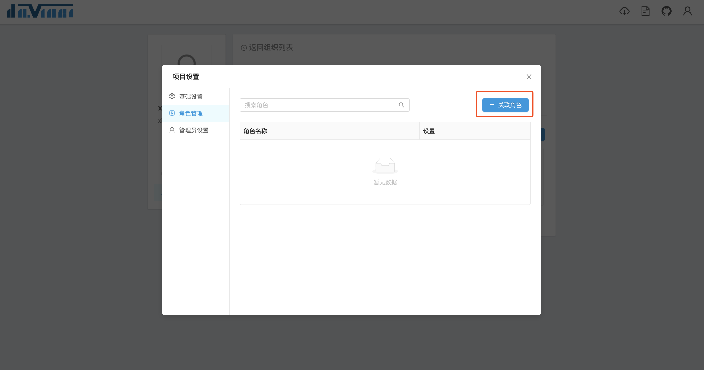
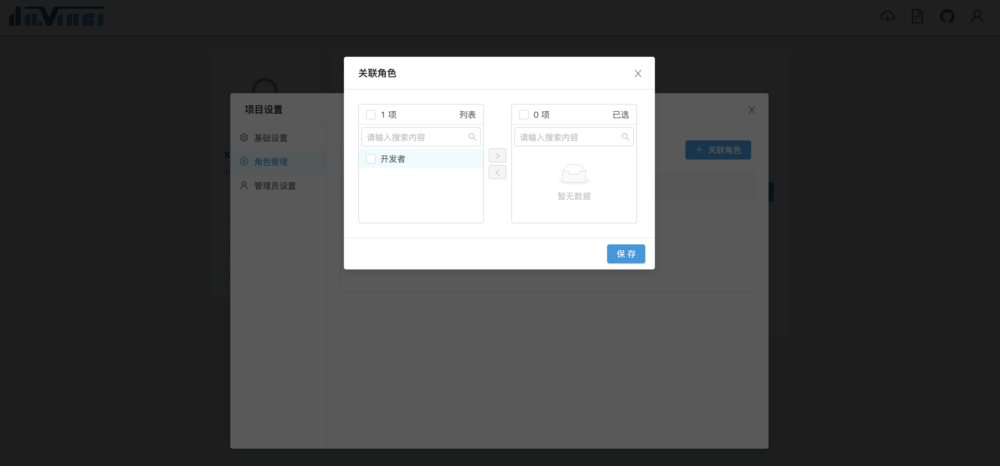
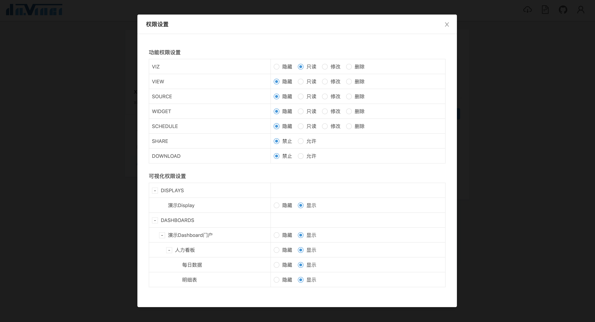
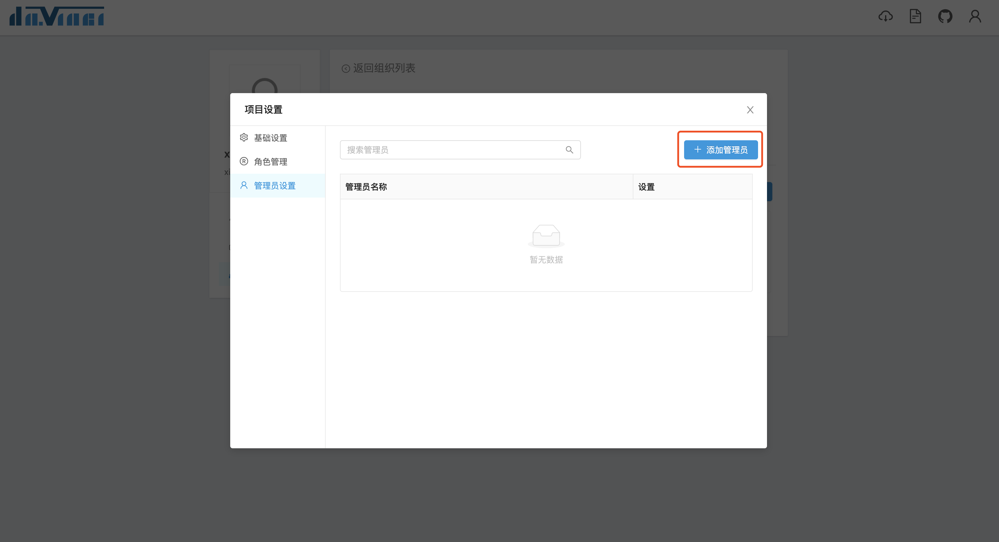
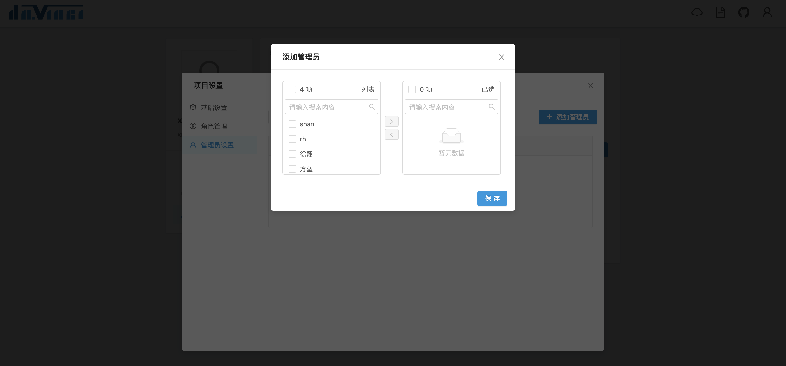

项目可以看做一组完整的可视化功能单元。Davinci 通过项目来对可视化功能（资源）来进行划分。一个项目中包含 Source（数据源）、View（数据视图）、Widget（可视化组件）、Viz（可视化应用）、Schedule（定时任务）5个功能模块，用户通过正确使用这些功能就可以打造自己的可视化应用。

关于功能模块的使用请回到 [功能详解](2.1-source) 进行了解。

## 1 创建项目

在项目页签，点击右侧的“+”按钮弹出创建项目表单

当可见选“公开”时，任何组织成员都可以看到该项目，并拥有项目 Viz 模块的只读权限；选“授权”时，只有该项目所关联角色关联的成员才能看到项目。

## 2 项目设置

点击项目名称下方的“齿轮”按钮弹出项目设置弹窗

在基础设置中，组织拥有者可以：
- 编辑项目的名称和描述
- 更改项目可见性
- 移交项目：用户可以将项目归属权移交给另一个**自己所在的组织**，需要注意的是，如果用户在另一个组织里不是拥有者，项目移交过去之后用户将不再拥有项目的管理权限。除了在这里，还可以在首页点击项目卡片右上角的小图标来移交项目
- 删除项目

## 3 角色权限设置
在项目设置里，组织拥有者可以管理项目与组织内角色的关联关系，并可以设置所关联角色在项目里的功能权限与可视化权限。

### 3.1 关联角色

在角色管理菜单，点击右侧的“关联角色”按钮弹出关联角色穿梭框，移动到穿梭框右侧的角色在保存后将与项目进行关联

### 3.2 权限设置

关联成功后，点击角色列表设置栏中的“权限设置”按钮弹出权限设置面板，面板中分为功能权限和可视化权限。

#### 3.2.1 功能权限
功能权限中除了基础的 5 个功能模块之外，还有包括分享和下载权限的设置。基础功能权限选项的意义如下：
- 隐藏：该功能模块对角色不可见
- 只读：角色仅拥有该功能模块的访问权限
- 修改：角色拥有该功能模块的访问、编辑权限
- 删除：角色拥有该功能模块的访问、新增、编辑和删除权限

#### 3.2.2 可视化权限
可视化权限可以管理仪表板和大屏包括所有子项的展示权限。可视化权限除了在这里设置之外，还可以在创建[仪表板](2.4-dashboard)和[大屏](2.5-display)时进行设置。

## 4 管理员设置

在管理员设置菜单，点击右侧的“添加管理员”按钮弹出添加管理员穿梭框，移动到穿梭框右侧的成员在保存后将成为项目管理员，拥有项目最大权限

