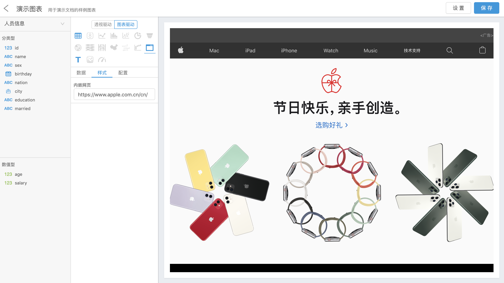

## 1 透视表

[透视表](https://en.wikipedia.org/wiki/Pivot_table)支持常规的数据透视、行列转换，还可以使用颜色给指标分组

如果需要按名称将指标值分开展示，可以使用“指标名称”字段

当有多个指标需要进行不同图表展示时，可以点击指标左侧进行图表切换

## 2 表格

表格是基于[Ant Design](https://ant.design/components/table-cn/)的表格组件做的封装，样式上支持如下配置：
- 表头样式配置
- 合并多级表头、二级以上表头顺序调整
- 固定表头
- 列样式配置
- 列排序
- 列样式条件判断
- 左、右固定列
- 行大小与边框
- 合并维度列中相同内容
- 分页
- 使用原始数据

其中列样式条件判断目前支持根据预设条件改变单元格背景色、字体和条形图，可以多条件叠加生效

当选择使用原始数据之后，Davinci 将**不再**对维度列做分组、指标列做聚合，而是展示数据视图中 SQL 执行后返回的明细数据

*注意：合并列命名后需要回车确认*

## 3 翻牌器

翻牌器展示不需要维度，可以设置1-3个指标。支持对指标字体、前后缀文字进行设置。展示形式固定，文字大小会随组件在仪表板或大屏中的尺寸发生变化

## 4 折线图

[折线图](https://en.wikipedia.org/wiki/Line_chart)展示需要1个维度、1个或多个指标

样式上支持如下配置：
- 线条平滑或阶梯展示
- 坐标轴
- 标签
- 图例
- 分隔线

## 5 柱状图

[柱状图](https://en.wikipedia.org/wiki/Bar_chart)展示有两种模式：
- 常规：1个维度、1个到多个指标
- 指标对比：0个维度，2个到多个指标

样式上支持如下配置：
- 条形图（90度翻转）
- 堆叠
  - 指标自由分组
  - 百分比显示
  - 总计
- 柱条样式
- 坐标轴
- 标签
- 图例
- 分隔线

## 6 散点图

[散点图](https://en.wikipedia.org/wiki/Scatter_plot)展示需要0个到多个维度、2个指标

样式上支持如下配置：
- 坐标轴
- 标签
- 图例
- 分隔线

## 7 饼图

[饼图](https://en.wikipedia.org/wiki/Pie_chart)展示有两种模式：
- 常规：1个指标，并使用维度做颜色分组
- 指标对比：2个到多个指标进行对比

样式上支持如下配置：
- 环形图
- 南丁格尔玫瑰图
- 标签
- 图例

## 8 漏斗图

[漏斗图](https://en.wikipedia.org/wiki/Funnel_chart)展示有两种模式：
- 常规：1个指标，并使用维度做颜色分组
- 指标对比：2个到多个指标进行对比

样式上支持如下配置：
- 排序
- 间距与对齐
- 标签
- 图例

## 9 雷达图

[雷达图](https://en.wikipedia.org/wiki/Radar_chart)展示有两种模式：
- 常规：1个维度、1个到多个指标
- 指标对比：0个维度，2个到多个指标

样式上支持如下配置：
- 形状
- 轴段数
- 内外标签
- 图例

## 10 桑基图

[桑基图](https://en.wikipedia.org/wiki/Sankey_diagram)展示需要2个到多个维度、1个指标

样式上支持如下配置：
- 节点
  - 拖动
  - 布局方向
  - 尺寸
- 标签

## 11 平行坐标图

[平行坐标图](https://en.wikipedia.org/wiki/Parallel_coordinates)展示需要1个到多个维度、1个到多个指标

样式上支持如下配置：
- 线条样式
- 坐标轴
- 坐标轴排列
- 坐标轴框选

## 12 地图

使用地图之前，请确认地图展示所需的维度字段已经正确设置[可视化类型](2.2-view#2-数据模型)，需要1个指标

地图通过样式配置可以选择一下4种类型

常规地图

气泡图

热力图

飞行图

选择飞行图时注意，需要2个维度，飞行轨迹从维度一到维度二

样式上支持如下配置：
- 移动&缩放
- 标签
- 视觉映射
- 飞行速度及标记

## 13 词云

[词云](https://en.wikipedia.org/wiki/Tag_cloud)展示需要1个维度、1个指标

## 14 瀑布图

[瀑布图](https://en.wikipedia.org/wiki/Waterfall_chart)展示需要1个维度、1个指标

样式上支持如下配置：
- 坐标轴
- 标签
- 分隔线

## 15 内嵌网页

内嵌网页展示不需要维度和指标，需要在样式栏输入内嵌网页地址

## 16 富文本

富文本展示上不强依赖于维度和指标，支持用户自定义文本样式，包括：
- 文字尺寸、字体、样式、颜色
- 列表样式
- 对齐方式
- 超链接
- 图片
- 清除样式

如果想将维度和指标值用于动态展示，可以将鼠标悬停在富文本工具栏最右侧的按钮上，点击列表项，这时维度和指标会以占位符形式插入到富文本中

点击右下角按钮预览富文本样式

需要注意，当所选维度有多个值时会全部显示，使用逗号分隔；同时指标值也会被分组

## 17 双Y轴图

双Y轴图展示需要1个维度，2个到多个指标

样式上支持如下配置：
- Y轴图形选择
- 坐标轴
- 折线线条平滑或阶梯展示
- 柱堆叠
- 图例
- 分隔线

## 18 仪表盘

仪表盘展示需要1个指标

样式上支持如下配置：
- 目标值
- 仪表盘样式
- 标题
- 数值
- 指针
- 轴
- 分隔线
