### 1 数据应用层

数据应用层（Viz，Visualization 的缩写），Davinci 0.3 提供了仪表板（Dashboard）和大屏管理（Display）两种不同的可视化应用交互探索模式。通过钻取、联动、分享、过滤器、控制器、视频、自由布局等操作，让 Widget 灵动起来，图文并茂，实现用户与数据直接对话，帮助用户更好地观察与分析数据，满足领导决策等多种应用需求。

- 在 Viz 页分别创建 Dashboard 和 Display 应用层。

  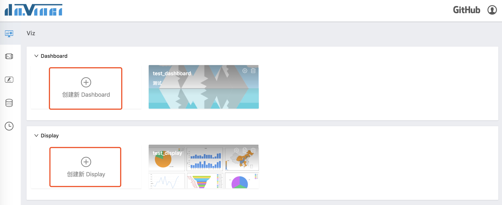

  弹框填写信息，其中“是否发布”作为新建 Dashboard/Display 应用的状态标记，“编辑”中的应用层灰底标出。支持编辑和删除 Dashboard，支持编辑、复制（*@TODO*）和删除 Display。

  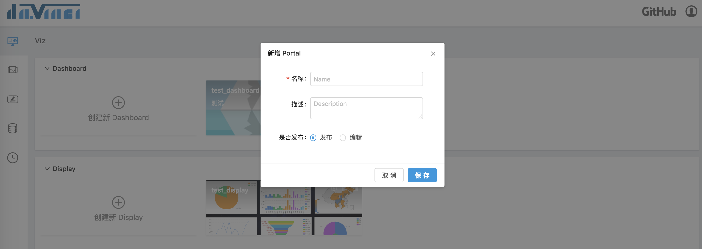

### 2 Dashboard 门户

Davinci 0.3 的 Dashboard 有菜单了，能将 Dashboard 分门别类，更好地梳理它们之间的层级关系。左侧菜单列支持创建、编辑、删除 Dashboard 或文件夹，支持搜索快速定位，通过点击菜单切换 Dashboard。

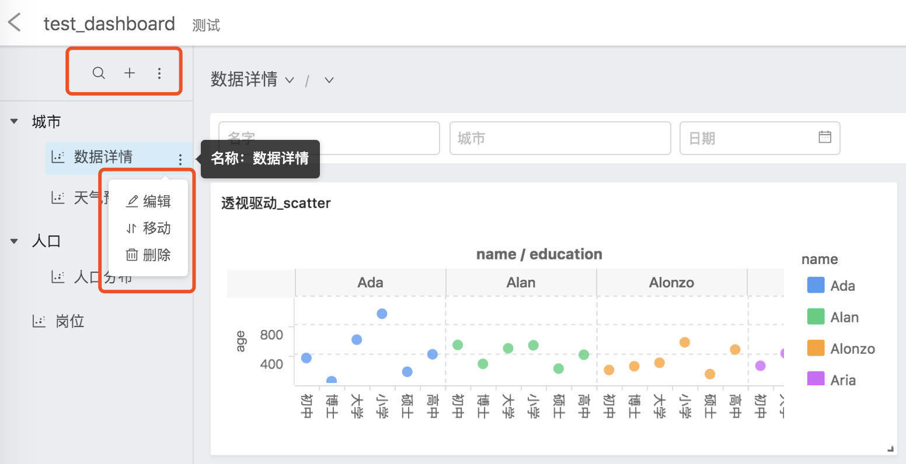

- 新建菜单项，弹框选择“所属文件夹”，默认属于根目录。

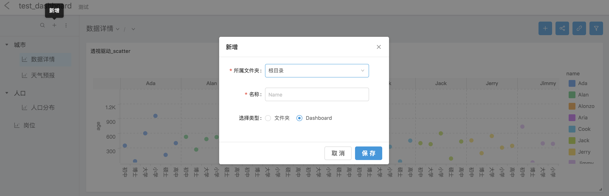

### 3 Dashboard 面板

在 Dashboard 内展示的 Widget，可以被随意地拖动改变位置、缩放改变大小。这些 Widget 之间还可以进行联动，可以轻松查看不同数据之间的关系。 同时，Dashboard 上可以定义全局控制器，对 Dashboard 内的 Widget 进行全局控制。

选中 Dashboard，右上角按钮是对当前 Dashboard 的全局操作。

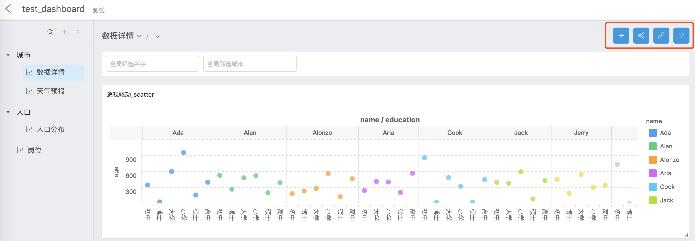

#### 3.1 新增

1. 弹窗是所有可供选择的 Widget，支持单个/批量添加 Widget。点击“下一步”。

   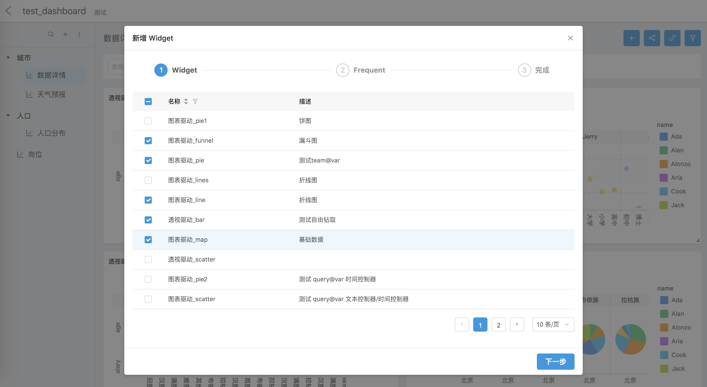

2. 配置数据刷新模式，保存。选中的 Widget 就会被添加到对应的 Dashboard了。

   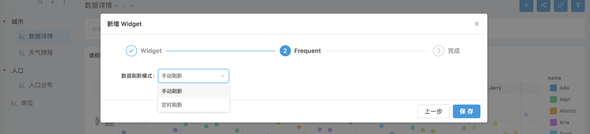

3. 在 Dashboard 里还可以进一步编辑和移动 Widget，拖拽出自己喜欢的排列方式。

#### 3.2 分享

1. 选择分享模式。普通分享，复制链接，粘贴到浏览器中即可。

   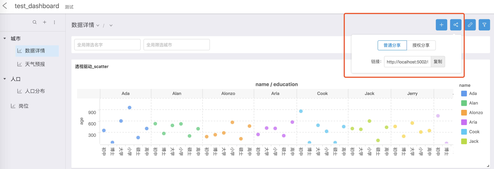

2. 授权分享，输入要分享的用户名。复制链接，粘贴到浏览器中，**需要该用户登录之后才可以访问**。

   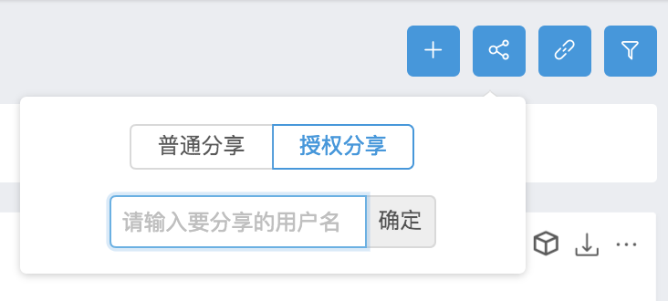

#### 3.3 联动

- 联动关系配置。

  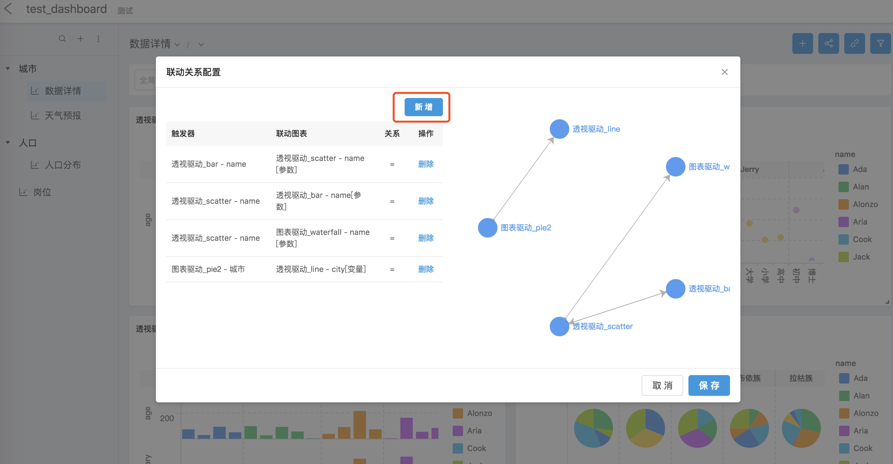

  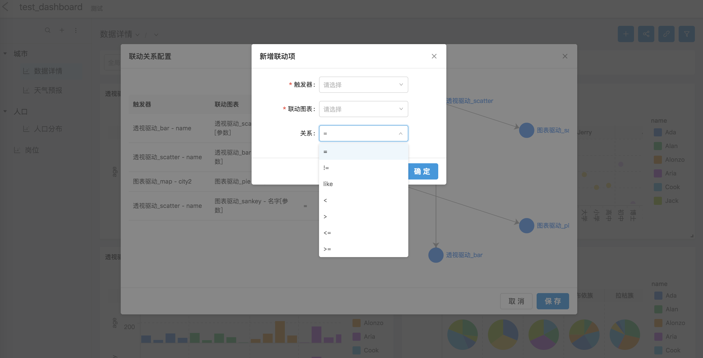

- 联动操作。单击联动，再次单击取消联动。

  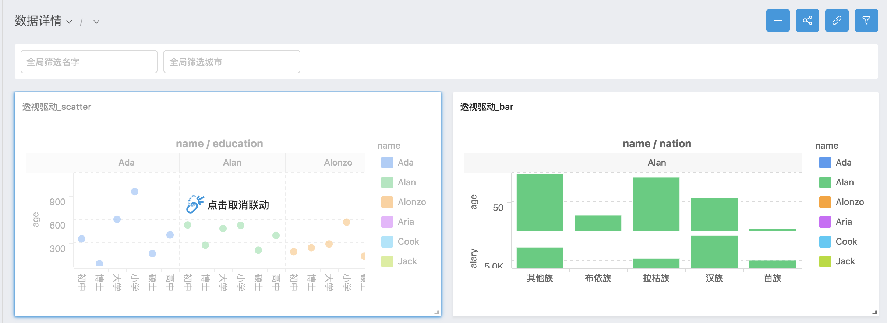

#### 3.4 全局筛选器

- 全局筛选器配置

  - 左侧全局筛选列表，支持同时配置多个筛选条件。

  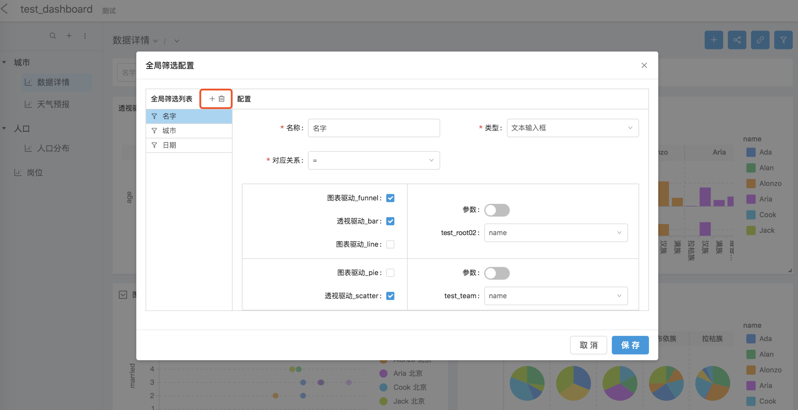

  - 右下表格第一列是该 Dashboard 所有的 Widget，第二列参数下面是 Widget 对应的 View，选择 View 的某个字段作为过滤条件（勾选的几个 Widget 所选字段的类型需要一致）。

    **这里的参数项配置可参考后面介绍的“控制器配置”**

    当参数开启时，下拉框内容是控制器配置的关联变量。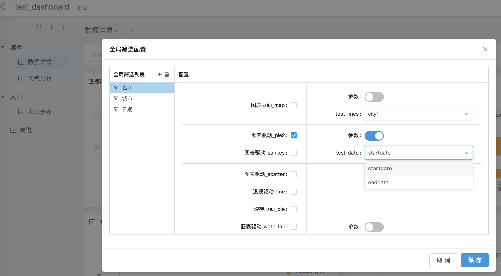

- 全局筛选器使用

  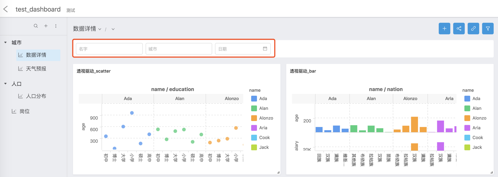

### 4 Dashboard Item

Dashboard Item 是 Dashboard 的最小组成部分，Dashboard Item 对应 Widget 组件，并拥有独立的功能。

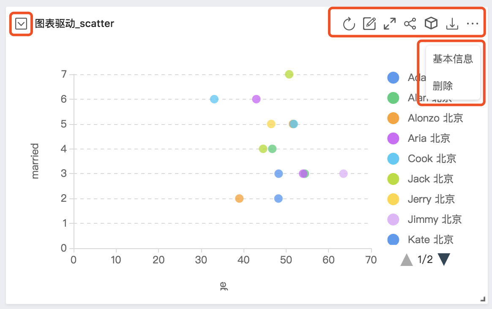

#### 4.1 全屏

左上角的小图标控制是否查看当前 Dashboard 所有的 Widget，这里你可以切换全屏显示的 Widget。“退出全屏”，回到 Dashboard 面板。

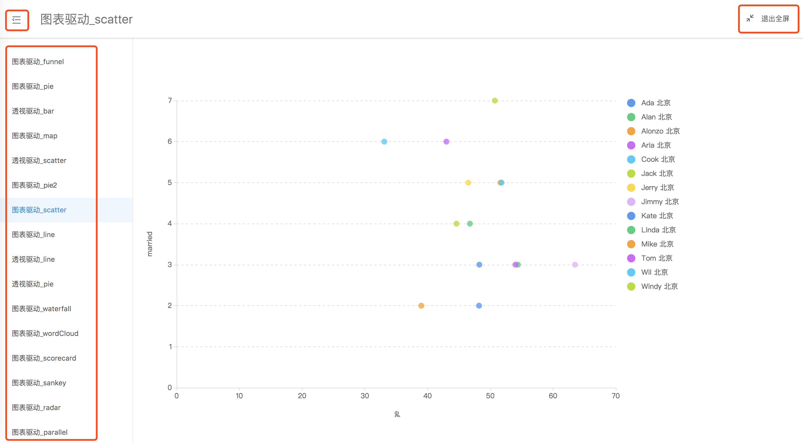

#### 4.2 自由钻取

钻取是上卷下钻的统称。上卷，当前数据往上回归到上一层数据。下钻，从当前数据往下展开下一层数据。

- 点击“钻取”，在图表上框选区域，选择上卷或下钻的字段。再次单击取消钻取。

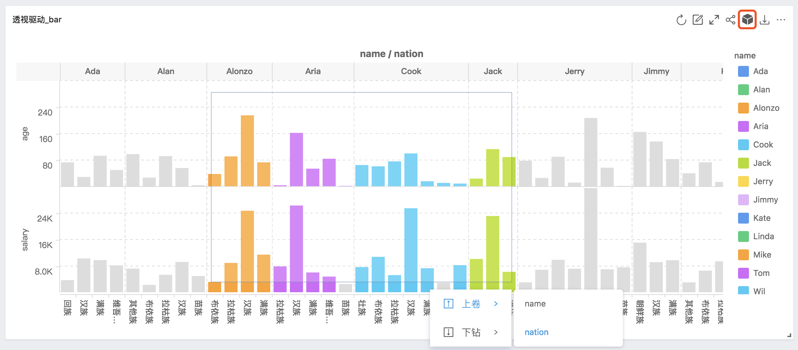

- 支持数据多层级钻取。

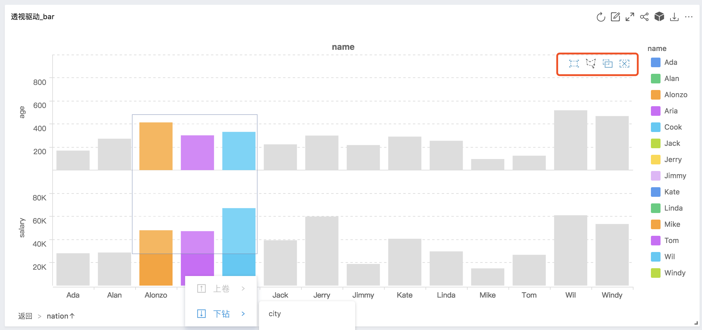

#### 4.3 分享/下载/编辑/删除

- 支持数据同步。
- 支持编辑 Widget。点击编辑，页面跳转到 Widget 编辑页。
- 支持修改数据刷新模式。选择“基本信息”。
- 支持分享 Widget。操作与 Dashboard 和 Dispaly 分享类似。
- 支持下载 CSV。
- 支持删除 Widget。