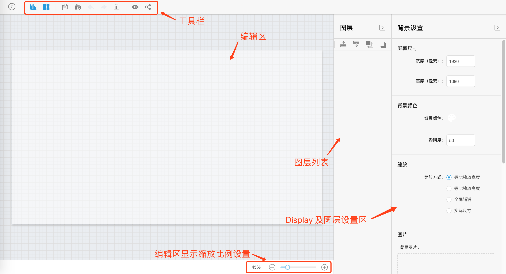
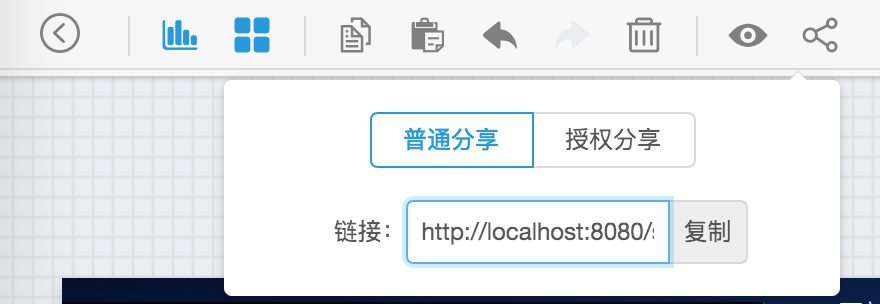
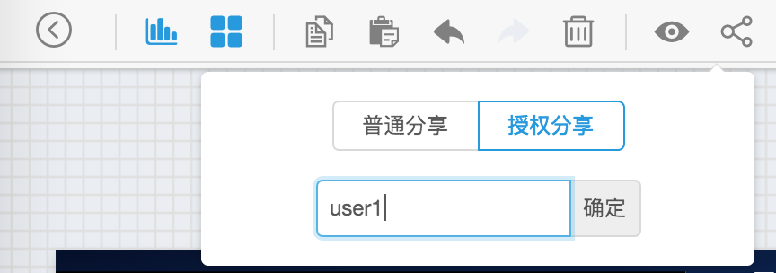
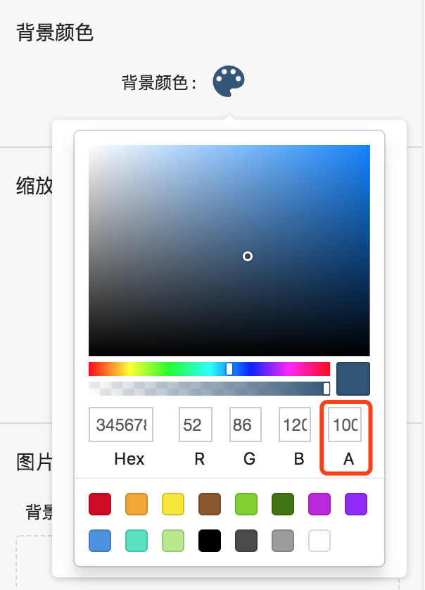
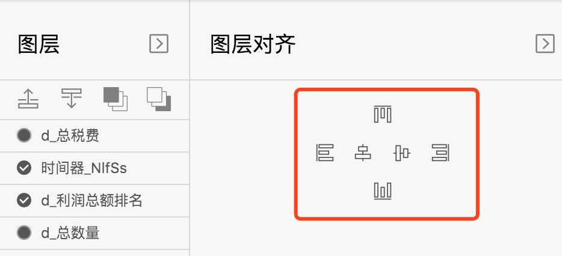

大屏（Display），即可视化大屏应用，适用于特定像素屏幕下数据可视化的应用场景。Display 所提供的组件功能较为复杂，对页面布局和样式要求较为精细。

首先需要在 Viz 门户列表页，创建 Display 应用层（详情介绍可见 3.7.1 “数据应用层”介绍）。

点击应用层进入 Display 编辑页。Display 编辑器分为“工具栏”、“编辑区”、“编辑区显示缩放比例设置”、“图层列表”、“Display 及图层设置区”。

### 1 工具栏

依次为添加 Widgets/添加辅助图形、复制/粘贴、撤销/前进、删除、预览、分享操作。 

点击 “Widgets” 或“辅助图形”添加，画布显示图层。单选/多选若干图层后，可点击“复制”/“粘贴”进行复制/粘贴操作，加快配置图层。点击“删除”删除图层。 编辑画布过程中，可随时点击“撤销”/“前进”来实现编辑的回滚和恢复。

上述功能同时也支持通过键盘快捷键控制，和我们平时使用的快捷键一致。

| 功能      | Mac 快捷键                     | Windows 快捷键         |
| --------- | ------------------------------ | ---------------------- |
| 复制/粘贴 | `Cmd + C` / `Cmd + V`          | `Ctrl + C`/ `Ctrl + V` |
| 删除      | `Delete`                       | Backspace              |
| 撤销      | `Cmd + z`                      | `Ctrl + z`             |
| 前进      | `Cmd + y` 或 `Shift + Cmd + z` | `Ctrl + y`             |

你可以随时点击”预览“打开网页新标签预览当前编辑 Display 的效果，具体预览的模式可在 Display 缩放模式中设置，默认为"等比缩放宽度”模式，即按宽度100%填充，高度按比例缩放。 

点击“分享” ，分享分“普通分享”和“授权分享”两种模式，与分享 Dashboard/Widget 类似。“普通分享”生成当前 Display 的链接，他人可直接打开此链接查看此 Display 大屏应用，无需先登录。“授权分享”需要输入要分享的 Davinci 用户名称，该用户登录 Davinci 之后，通过链接查看 Display 应用。

### 2 编辑区

编辑区中可对已添加的图层拖拽大小和位置。拖拽过程中，垂直和水平方向会动态出现参考线，可使拖拽后的位置更为准确。
目前垂直和水平方向共有 1/4、1/3、1/2 长度处的参考线显示；对于图层之间，当拖拽至水平或垂直方向居中对齐时，也有参考线提示；不同于编辑界面的参考线横跨整个编辑区域范围，图层之间的参考线位于图层之间。
选择图层之后，可通过键盘中的上下左右方向键，平移所选择图层的位置。
默认点击图层以单选，按住 Alt 键（Windows 系统）或 Cmd 键（Mac 系统），再点击可实现多选图层。
拖拽大小和位置，键盘箭头键控制图层位置也支持操作多图层。
对于图表类型的图层，在鼠标悬浮其上时，其右上角显示编辑图标，点击可链接到 Widget 编辑页面，可更新该 Widget 的设置，完成后页面自动跳回 Display 的编辑界面。
点击编辑区空白处可取消选择所有图层。

### 3 编辑区显示缩放比例设置

对于编辑屏幕尺寸较大（或较小）的 Display 应用，会出现整个画布显示不下（或显示过小）的情况，此时可通过点击减号（加号）按钮按比例进行缩小（放大）以适应整个画布的显示。

### 4 图层列表

图层列表显示当前 Display 目前所有的图层情况，且按照纵向叠加方向由顶层至底层顺序显示。
选择图层的操作与编辑区选择图层操作一致。 
图层列表上方按钮为对图层层级的设置，依次为“上移一层”、“下移一层”、“置顶”、“置底”操作。
点击图层右上方箭头可对该区域进行展开或关闭。

### 5  Display 及图层设置区

该区域为复合设置区域，依照当前 Display 中图层的选中状态显示不同的设置。点击图层右上方箭头可对该区域展开或关闭。  

- 未选中任何图层时
  当前 Display 的设置，包括“屏幕尺寸”、“背景颜色”、“缩放方式”、“背景图片”、“封面图片”。

  - **背景颜色**，可通过点选颜色面板或直接输入 Hex 或 RGB 的值设置，其中 A 值为透明度设置，范围 0到 100，0 为全透明，100 为不透明。Display 编辑页所有颜色都是这样设置。 

  

  - **缩放方式**，指定了当前 Display 显示的终端屏幕与其配置的屏幕尺寸不一致时的显示策略。
    一共有四种模式，分别为”等比缩放宽度“、”等比缩放高度“、”全屏铺满“、”实际尺寸“。其中只有”全屏铺满“不保证最终显示的长宽比与配置一致，而是根据显示终端的屏幕自动进行缩放，保证全屏显示。其中 1、2 两种模式保证了单一方向的 100% 自适应，而另一方向将会有缩放。”实际尺寸“则是按配置宽高进行显示。
  - **封面图片**，通过点击“截取封面”生成当前 Display 的快照，截取后的图片自动成为 Viz 门户页中该 Display  的封面图。

- 选中单个图层
  当选择单个图层时，设置区域显示该图层对应类型下所有可用的设置，可自行修改设置项的值查看效果。
  对于 Display 也支持对 Widget 图表类型设置”数据刷新“模式，”手动刷新“的图表只能通过刷新页面来刷新数据；”定时刷新“，页面会根据设置的”时长“（单位为秒）自动按固定周期刷新图表，通常用于实时数据展示的场景。

- 选中多个图层
  通过 `Cmd + 点击` （Mac）或 `Alt + 点击` （Windows）选择多个图层后，设置区如下图所示：

  
  此时可设置多个图层的整体对齐方式。  