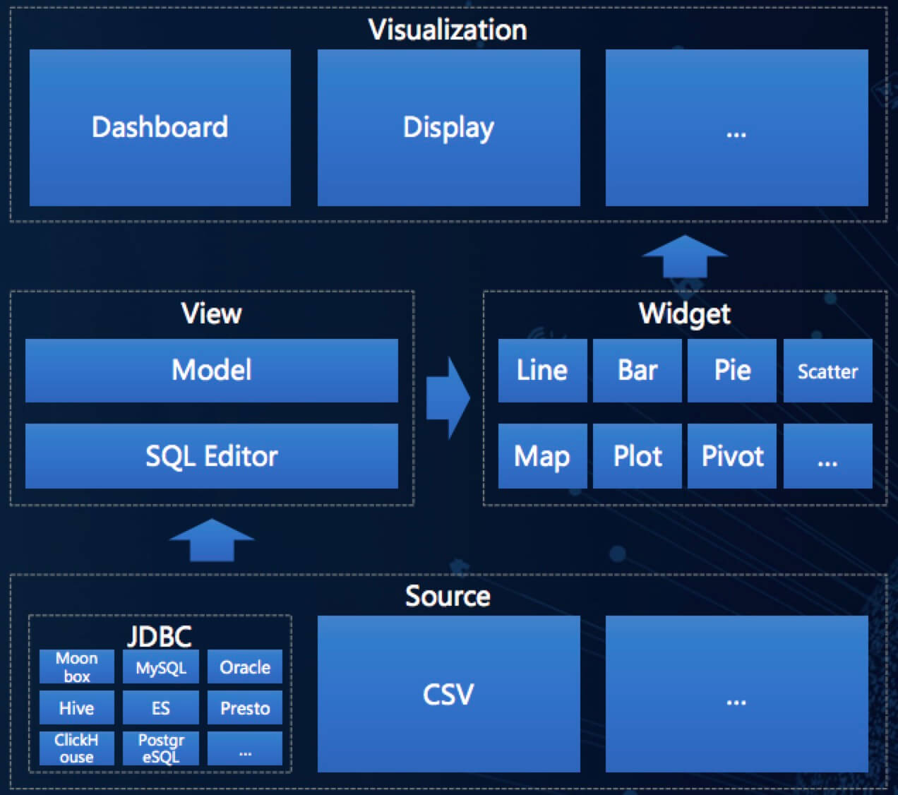

## 1 平台介绍

Davinci 是一个 DVaaS（Data Visualization as a Service）平台解决方案，面向业务人员/数据工程师/数据分析师/数据科学家，致力于提供一站式数据可视化解决方案。既可作为公有云/私有云独立部署使用，也可作为可视化插件集成到三方系统。用户只需在可视化 UI 上简单配置即可服务多种数据可视化应用，并支持高级交互/行业分析/模式探索/社交智能等可视化功能。

## 2 模块架构

## 3 设计理念

- **围绕 View（数据视图）与 Widget（可视化组件）两个核心概念设计**
  - View 是数据的结构化形态，一切逻辑/权限/服务等相关都是从 View 展开。
  - Widget 是数据的可视化形态，一切展示/交互/引导等都是从 Widget 展开。
  - 作为数据的两种不同形态，二者相辅相成，让用户拥有一致的体验和认识。

- **强化集成定制能力和智能社交能力**
  - 集成定制能力指无缝集成到三方系统，并提供强大的定制化能力，使其和三方系统融为一体。
  - 社交智能能力指共享优秀的数据可视化思想，激发用户对数据可视化表达能力和艺术美感的追求，同时也使 Davinci 更加智能的引导和提高用户的数据可视化能力。
  - 在数据可视化领域里，Davinci 重视基础的交互能力和多种多样的图表选择能力，同时更加重视集成定制能力和社交智能能力。

## 4 功能特点

- **数据源**
  - 支持多种 JDBC 数据源
  - 支持 CSV 数据文件上传

- **数据模型**
  - 支持友好 SQL 编辑器进行数据处理和转换
  - 支持自动和自定义数据模型设计和共享

- **可视化组件**
  - 支持基于数据模型拖拽智能生成可视化组件
  - 支持各种可视化组件样式配置
  - 支持自由分析能力

- **数据门户**
  - 支持基于可视化组件创建可视化仪表板
  - 支持可视化组件自动布局
  - 支持可视化组件全屏显示、本地控制器、高级过滤器、组件间联动、群控控制器可视组件
  - 支持可视化组件大数据量展示分页和滑块
  - 支持可视化组件 CSV 数据下载、公共分享授权分享以及可视化仪表板的公共分享和授权分享
  - 支持基于可视化仪表板创建数据门户

- **数据大屏**
  - 支持可视化组件自由布局
  - 支持图层、透明度设置、边框、背景色、对齐、标签等更丰富大屏美化功能
  - 支持多种屏幕自适应方式

- **用户体系**
  - 支持多租户用户体系
  - 支持每个用户自建一整套组织架构层级结构
  - 支持浅社交能力

- **安全权限**
  - 支持 LDAP 登录认证
  - 支持动态 Token 鉴权
  - 支持细粒度操作权限矩阵配置
  - 支持数据列权限、行权限

- **集成能力**
  - 支持安全 URL 嵌入式集成
  - 支持 JS 融入式集成

- **多屏适应**
  - 支持大屏、PC、Pad、手机移动端等多屏自适应

## 5 场景支持

- **安全多样自助交互式报表**

  一次配置即可实现可视组件高级过滤、高级控制、联动、钻取、下载、分享等，帮助业务人员快速完成对比、地理分析、分布、趋势以及聚类等分析和决策。

  自动布局的 Dashboard（仪表板），适用于大多数通过快速配置即可查看和分享的可视化报表。

  自由布局的 Display（大屏），适用于一些特定的、需要添加额外修饰元素的、长时间查看的场景，通常配置这类场景需要花一定的时间和精力，如“双11”大屏。

- **实时运营监控**

  实时观察运营状态，衔接各个环节流程，对比检测异常情况，处理关键环节问题。

  透视驱动与图表驱动两种图表配置模式，满足不同的应用场景需求。

- **快速集成**

  分享链接、IFRAME 或调用开发接口，方便快捷地集成到三方系统，并能够支撑二次开发与功能拓展，充分适应不同业务人员的个性化需求，快速打造属于自己的数据可视化平台。

## 6 Davinci 0.3 与 0.2 的区别

- #### **五个重大变化**

  - [x] 打通了数据可视化全流程协作模式
  - [x] 打通了用户体系和权限体系
  - [x] 打通了数据模型和自由分析
  - [x] 打通了透视驱动模式和图表驱动模式配置可视化组件
  - [x] 打通了自动布局和自由布局支持各种可视化应用

- #### **在功能上具体的变化**

  1. **全新协作流程**

     多出“项目”的概念，Davinci 0.2 的 Source、View、Widget、Dashboard、Schedule 都从属于一个“项目”，Dashboard 这一层命名为“可视化应用”，Dashboard 属于“可视化应用”里其中的一种。

  2. **全新用户系统**

     在 Davinci 0.2 中，用户权限围绕超级管理员和普通用户展开。Davinci 0.3 里用户角色不再分管理员和普通用户，每个用户都是平级的，都可以创建组织和团队，组织和团队拥有对项目进行浏览、添加、修改、删除、点赞以及收藏等操作权限，组织可以转交拥有者，团队可以转交维护者。通过这个系统既能完全实现用户权限控制，同时又拥有了社交化。

  3. **数据模型与自由分析**

     对于用户配置好的数据视图，Davinci 0.3 可以为其自动生成数据模型，数据模型里将字段分作“维度”和“指标”两种类型，用户也可以手动指定维度和指标。在 Widget 内支持用户对指定的维度进行自由钻取，方便用户进行数据探索分析工作。

  4. **全新 Widget 编辑器**

     在 Davinci 0.3 中，用户通过预先配置好的数据模型，在 Widget 编辑器中可以选择想要显示的维度和指标，编辑器自动推荐出适合用来可视化的图形。可以通过颜色对字段进行分组编码。

  5. **全新可视化应用 Display**

     在 Davinci 0.3 中，可视化应用里除了包含之前的 Dashboard 外，还多了 Display。Display 支持用户将 Widget 以自定义布局和背景的方式放置到画布中，同时 Display 本身也支持自定义尺寸和背景，在多种搭配之下用户可以自己打造多样化的可视化应用。