Davinci 0.3 引入了一种新的用户体系和权限体系。在设计上，我们运用了“去中心化”的思想，每个用户都能自配一套完整的组织架构层级结构，任何一个注册用户都既可以是管理员，也可以是普通用户。相比 Davinci 0.2 只有一个管理员和若干个普通用户，0.3 实现了更加开放化、扁平化、平等化、多元化的系统现象和体系结构。

### 1 组织管理

用户注册并通过邮箱激活进入系统，系统为该用户创建一个默认组织。该用户为默认组织的 Owner 角色。组织有 Owner（拥有者） 和 Member（普通成员） 两种角色，Owner 拥有对组织的所有权限，可邀请其他用户进入该组织协同工作，Member 是协同工作的参与者。

- 点击右上角图标，选择“用户设置”。

  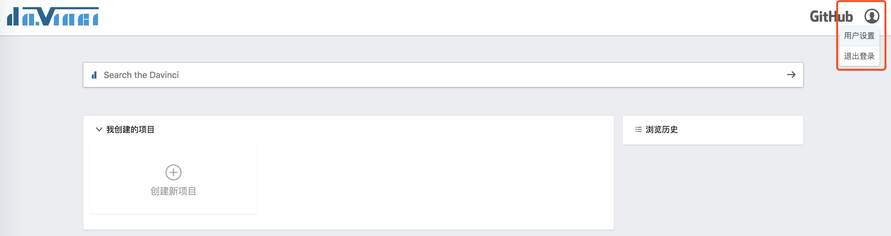

- 选择“我的组织”，查看组织列表。

  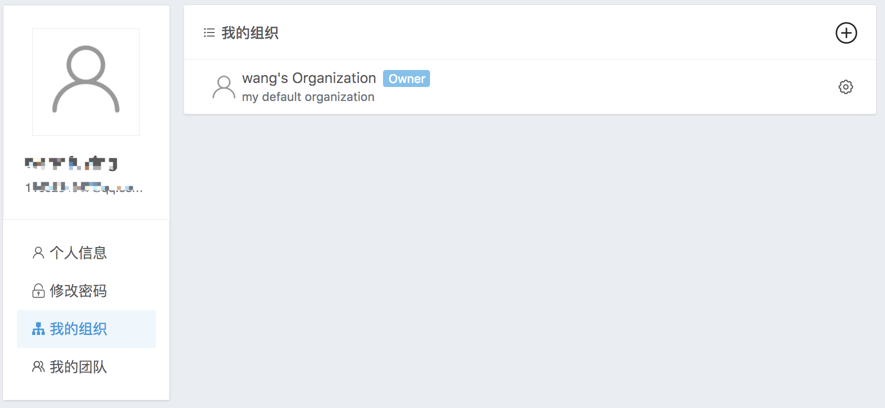

- 用户可创建若干个组织，满足其他业务需求。点击右上角“+”，弹框创建。

  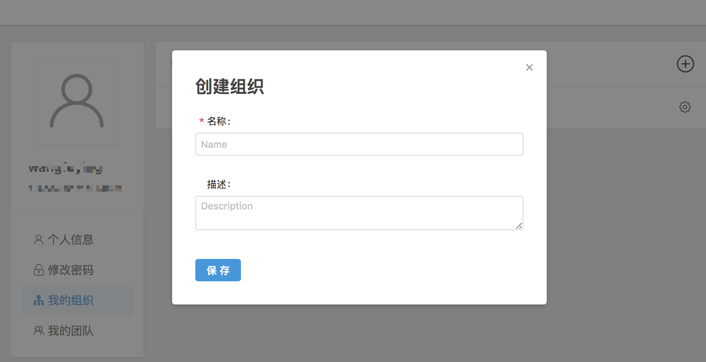

#### 1.1 项目

Davinci 0.3 引入了“项目”的概念，项目从属于组织。每个项目都是独立的 Davinci 应用， Davinci 应用由 Viz， Widget，View， Source， Schedule 几个模块组成。

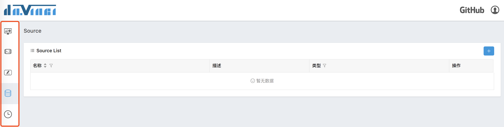

- 编辑和删除项目。

  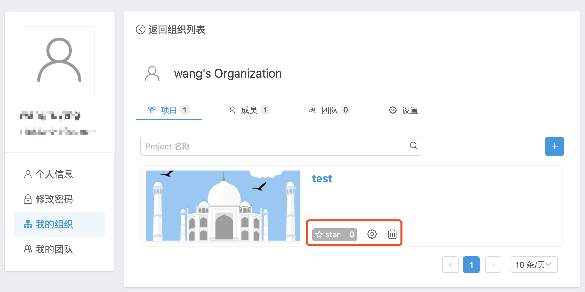

- 点赞项目，单击数字，查看点赞用户的详细信息。再次点击取消点赞。

#### 1.2 成员

组织成员有 Owner 和 Member 两种角色，Owner 可以提升 Member 为 Owner，一个组织允许有多个 Owner，他们的权限相同。

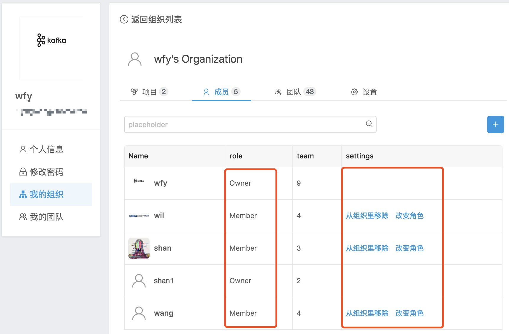

- Owner 邀请注册用户加入自己的组织协同工作（被邀请人需要进入邮箱接受邀请），被邀请人为该组织的 Member 角色。

  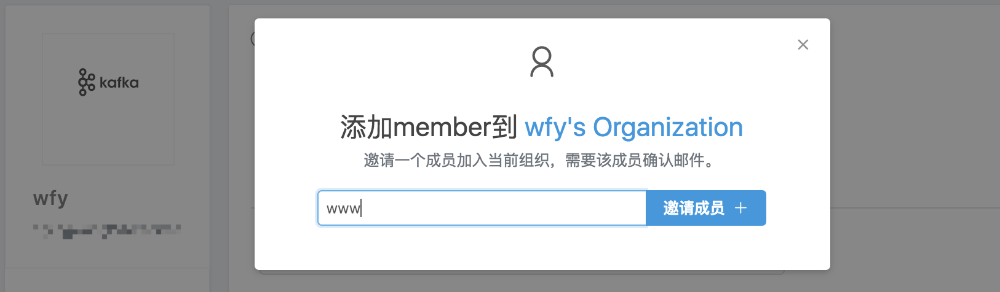

#### 1.3 设置

Owner 能给组织上传图像，编辑组织信息或删除组织。Owner 可以决定是否允许组织的 Member 创建项目，也可以决定组织的 Member 是只可见公开项目，还是不可见任何项目。

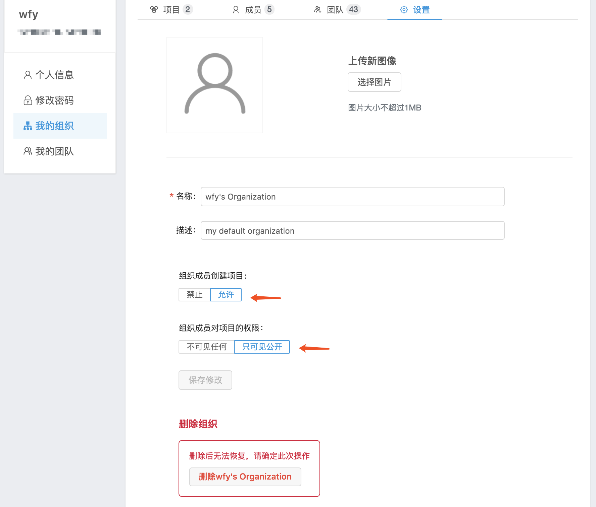

### 2 团队与权限管理

Davinci 0.3 是通过团队来管理项目，团队从属于组织。团队有 Maintainer（维护者）和 Member（普通成员）两个角色。通过下图来看四种不同角色的权限。

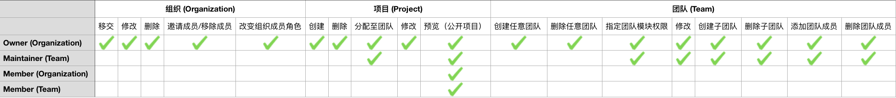

团队可以是级联结构，能对接企业组织架构。一个组织能有多个 Team 树，组织相当于根节点的概念，但不属于树。一个用户能同时属于多个团队。

组织下创建团队。弹框选择上级 Team，保存。

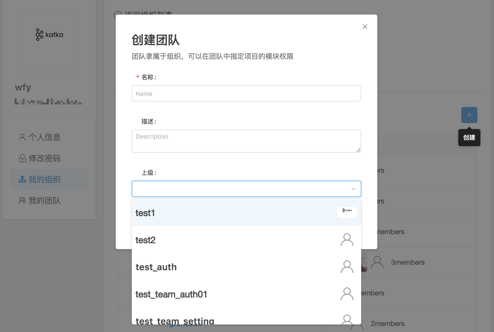

#### 2.1 成员

团队成员分为 Maintainer 和 Member。团队的创建者默认为团队的 Maintainer，Maintainer 是团队的管理者，可邀请组织成员加入 Team 协同工作，也可以分配组织的项目到当前 Team，Member 是协同工作的参与者。

- Maintainer 能移除团队里的所有人，也能改变团队所有人的角色。

  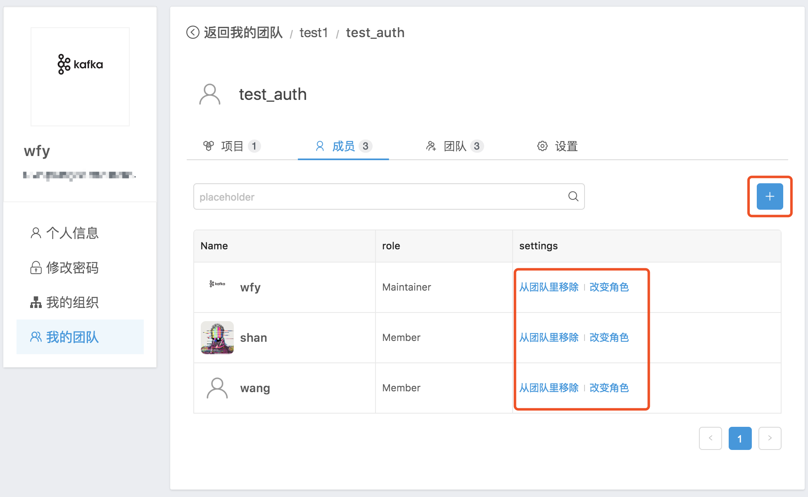

- Maintainer 添加成员到自己所在的团队。

  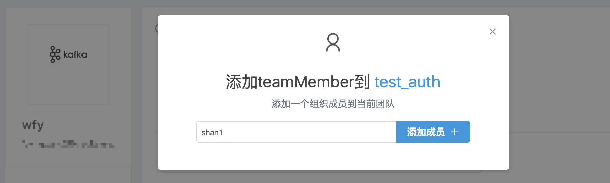

#### 2.2 项目

团队的 Maintainer 分配项目到团队，通过团队管理项目的模块权限和数据权限。一个项目能被分配到多个团队，普通成员通过团队参与项目。

**添加项目到当前团队**

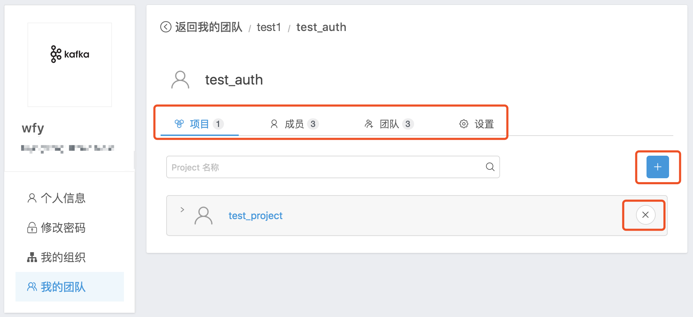

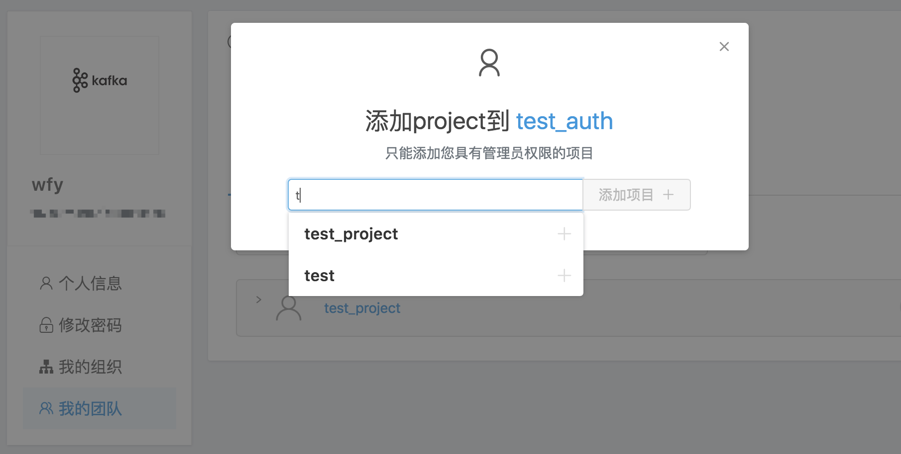

**模块权限**

模块权限指的是允许或拒绝团队的普通用户使用 Davinci 应用提供的某个/些模块。

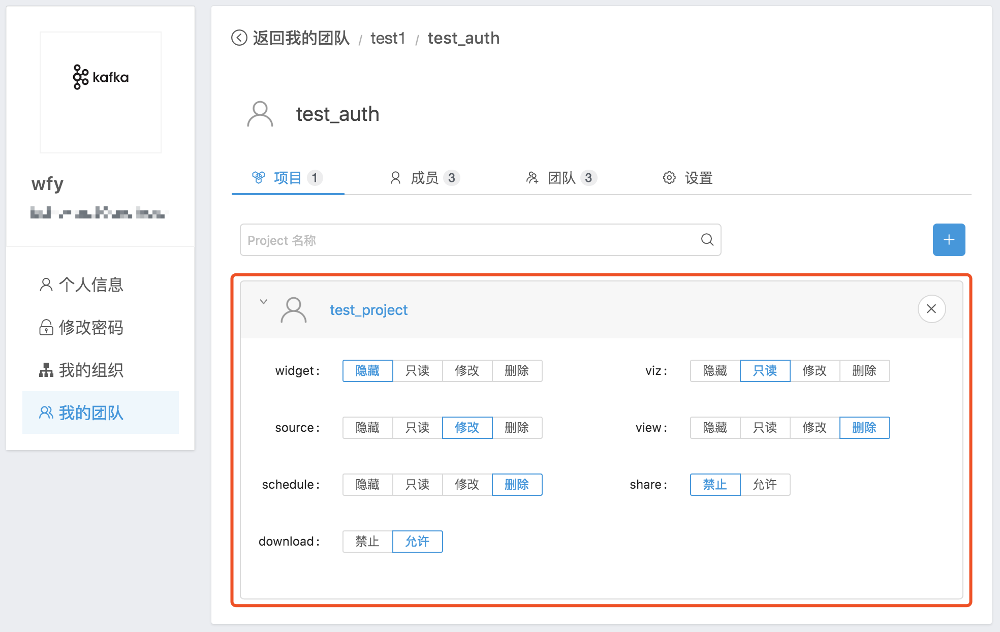

| 设置项 | 团队 Maintainer 对 Member 授权 |
| ------ | ------------------------------ |
| 隐藏   | 不可见                         |
| 只读   | 只有查看权限                   |
| 编辑   | 只有查看和修改权限             |
| 删除   | 拥有所有操作权限               |
| 允许   | 允许分享/下载                  |
| 禁止   | 禁止分享/下载                  |

例如：按上图对 “test_project” 项目进行配置，那么，该团队里的普通成员对该项目的 Widget 不可见，对 Viz 只能查看，不能新建、编辑、删除或复制，对 Source 能查看和修改，对 View 和 Schedule 拥有所有的权限，不能分享 Widget/ Dashboard/Display，能下载 CSV 文件。

**数据权限**

数据权限指的是允许或拒绝团队普通成员访问某个/些数据。

由 `team@var` 变量来控制团队的数据权限，配置参看 3.5.2 “**配置视图**”的“**团队数据权限控制**”部分。

#### 2.3 团队

团队的 Maintainer 能在当前团队里创建子团队。

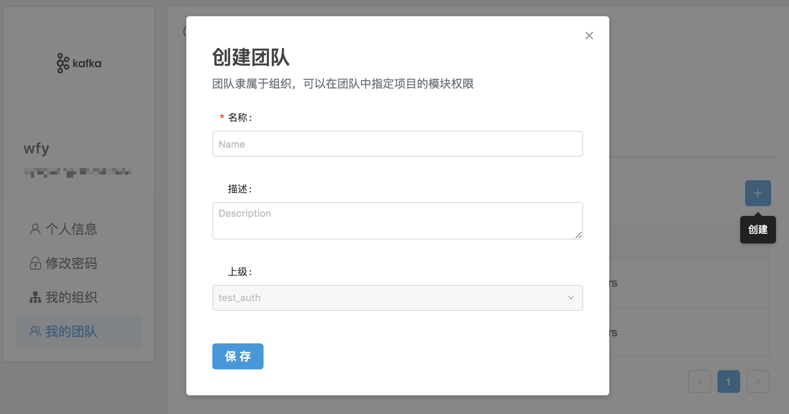

#### 2.4 设置

编辑和删除当前团队。

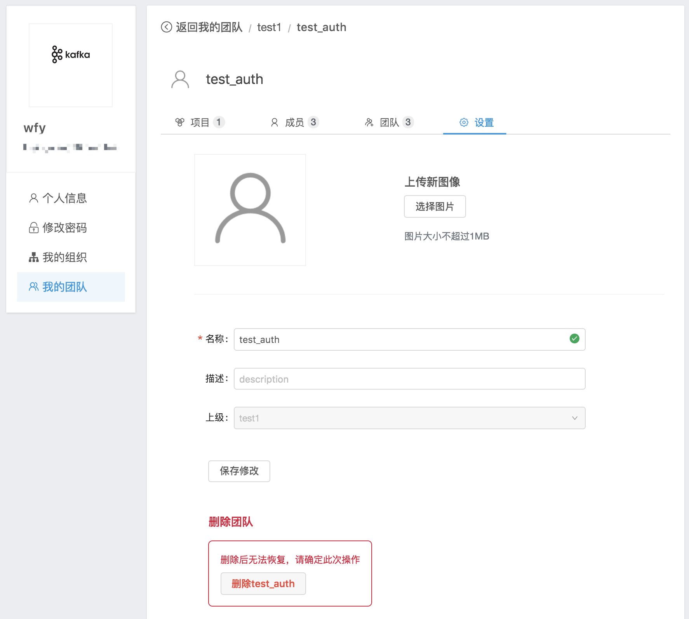

### 3 项目管理

登录系统，首页是该用户在不同组织中项目的快捷入口，主要由“我创建的项目”和“我参与的项目”组成，你能从这里快速定位并进入某个项目，操作 Source、View、Widget、Viz、Schedule 功能。项目的创建者拥有操作该项目的所有权限。

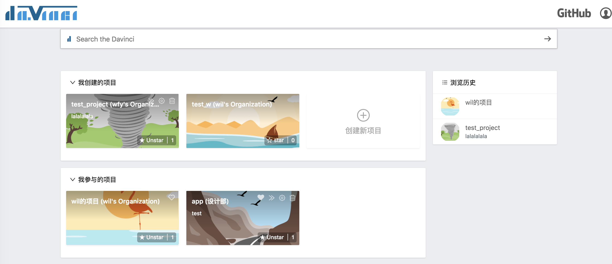

#### 3.1 创建项目

- 弹框中选择项目所属的组织和项目的可见性。项目可见性设置与组织设置相关联，只有当项目为“公开”、组织的 Owner 设置成员对项目的权限为“只可见公开”时，组织的 Member 成员才能查看公开的项目。

  你也可以在“我的组织”页创建项目。

  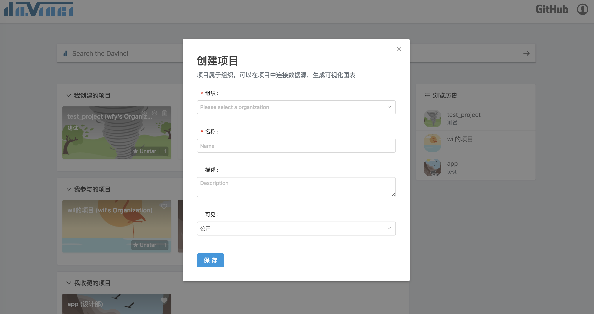

#### 3.2 移交、编辑、删除项目

- 分别点击右上角的按钮。

  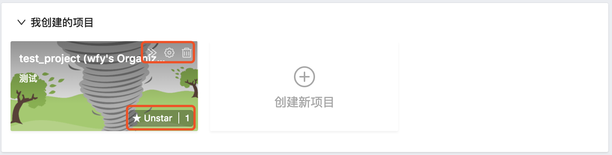

- 组织的 Owner 能把项目移交给其他组织。

  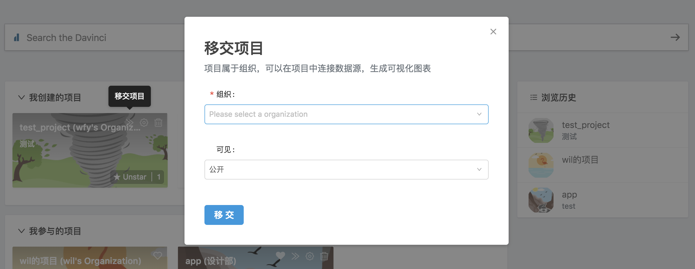

#### 3.3 收藏、搜索项目

- 收藏类似于快照功能，对项目进行在线备份与恢复，同时给用户提供另一个访问项目的通道。

  点击“收藏”，项目被添加到“我收藏的项目”中，再次点击取消收藏，也可以在“我收藏的项目”中点击“取消收藏”。

  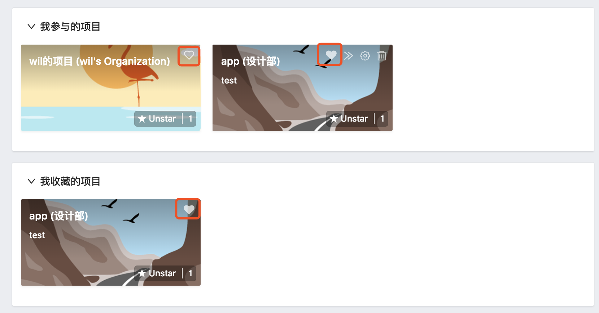

- 输入项目名称，快捷搜索并进入项目中。

  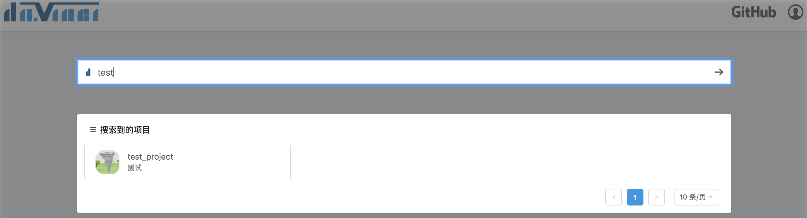

### 4 用户设置

#### 4.1 修改和查看个人信息

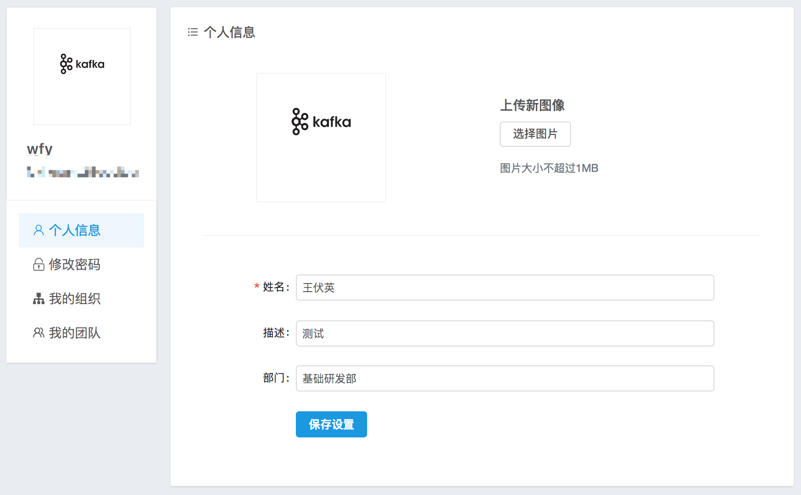

#### 4.2 修改密码

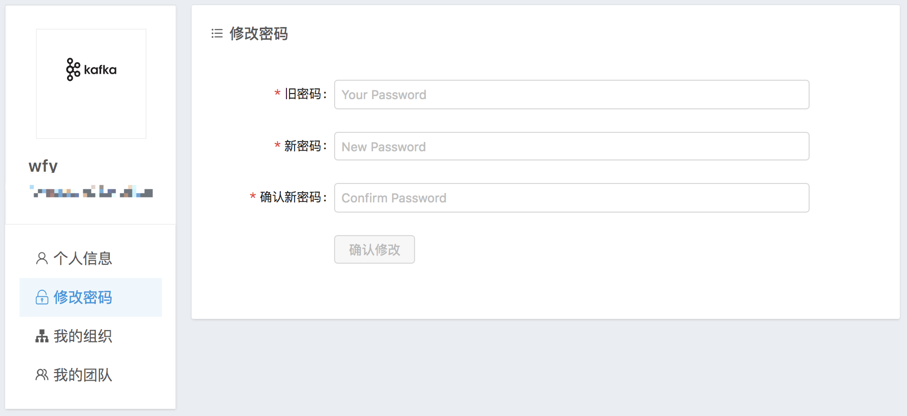