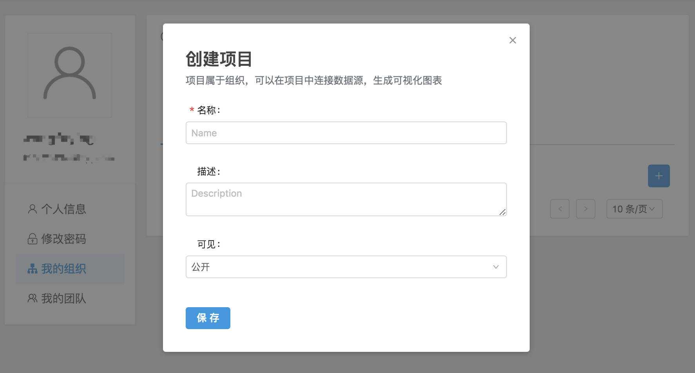
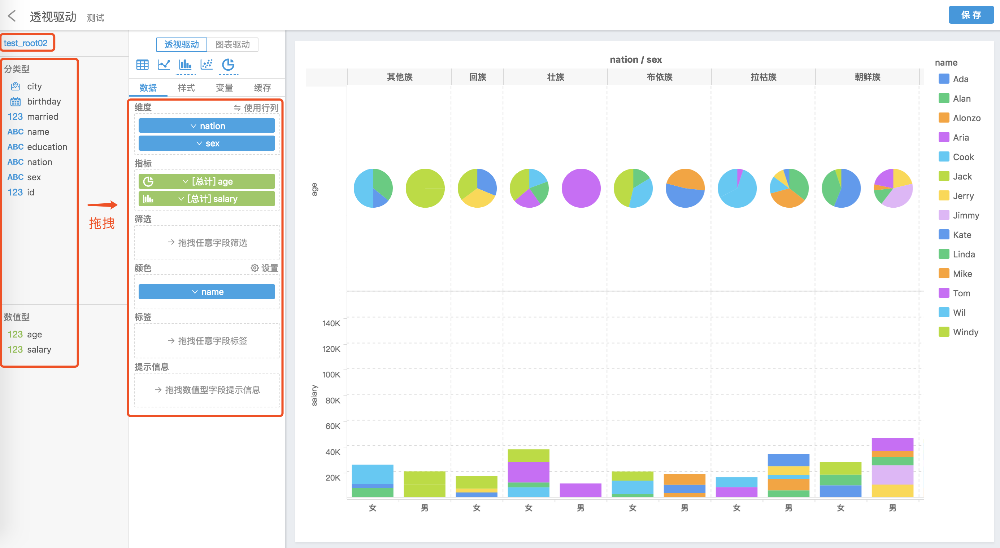
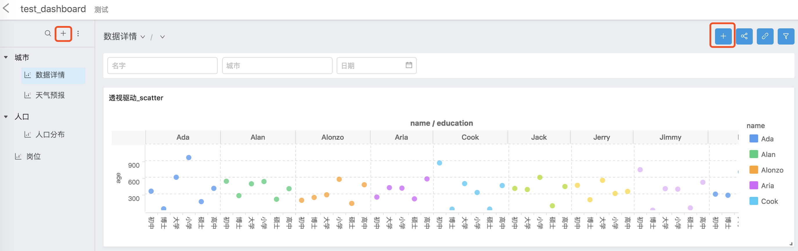
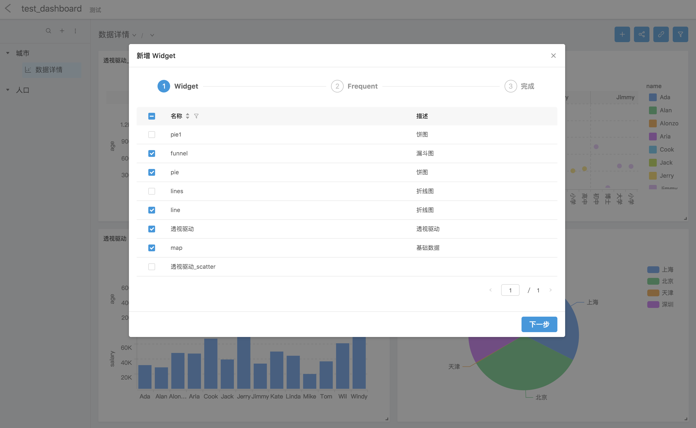
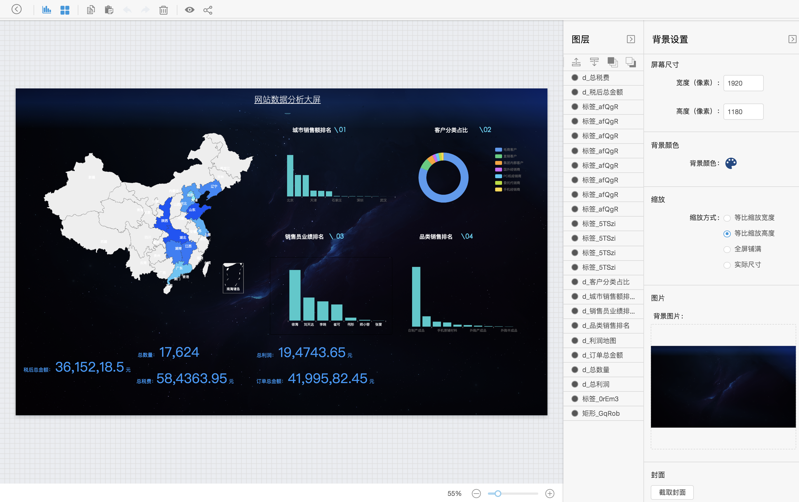
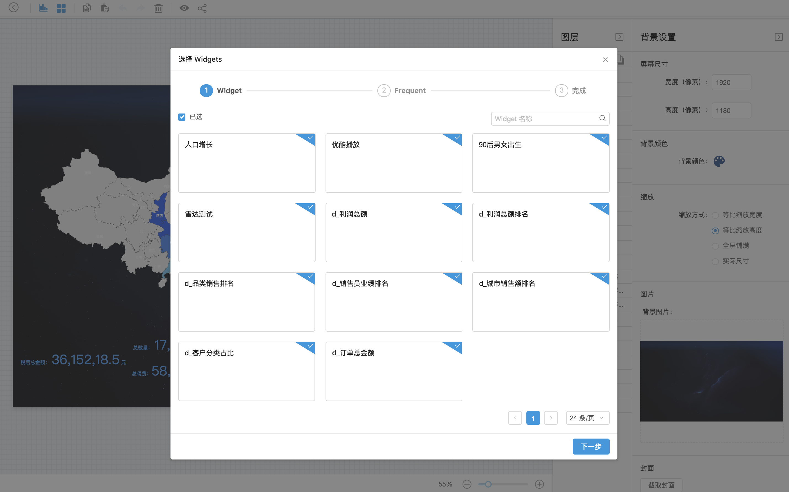
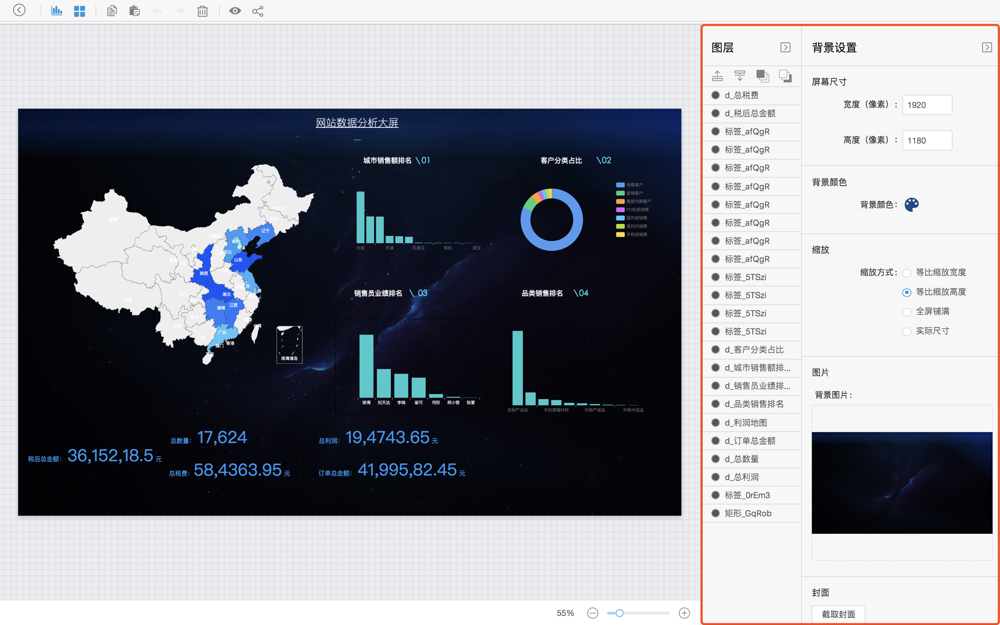

我们先来实现第一个应用。如果某一步不会操作，别担心，你可以到后面的章节中找对应的介绍。

**注册**

Davinci 0.3 需要用户自己注册系统账号，注册前确保邮件服务器已正确配置。填写真实的邮箱地址，用于接收注册邮件，密码不需要为邮箱对应的密码。点击注册后，到对应的邮箱中激活。

**登录**

**创建 Project**

登录成功后，系统默认分配一个组织，你能在该组织下创建项目。

**创建 Widget**

进入项目。创建 Widget 之前，确认导入了数据源并建立了合理的视图。

1. 在 Widget 列表，点击右上角“新增”。

2. 进入 Widget 编辑页，选择数据驱动模式以及想要的展示方式，并进行简单的图表配置，点击“保存”并退出。

   

**创建 Viz**

进入 Viz 页，创建 Dashboard 和 Display 应用层。

**创建 Dashboard**

1. 进入 Dashboard 应用层，新建 Dashbord 菜单项，再点击右上角“新增”。

   

2. 弹窗是所有可供选择的 Widget，选中一个或多个 Widget，点击“下一 步”。

   

3. 配置数据刷新模式，保存，选中的 Widget 就被添加到对应的 Dashboard 了。你还可以进一步编辑和移动 Widget，拖拽出自己喜欢的排列方式。

这样我们的第一个 Dashboard（仪表板）就创建完成了。

**创建** **Display**

1. 进入 Display，点击顶部菜单的 “Widgets”。

   

2. 与 Dashboard 类似，弹窗选择 Widget，点击“下一 步”。

   

3. 配置数据刷新模式，保存，选中的 Widget 就被添加到对应的 Display 了。你能够自由地编辑和移动 Widget，拖拽和配置出自己喜欢的样式。

   

这样我们的第一个 Display（大屏）就创建完成了。