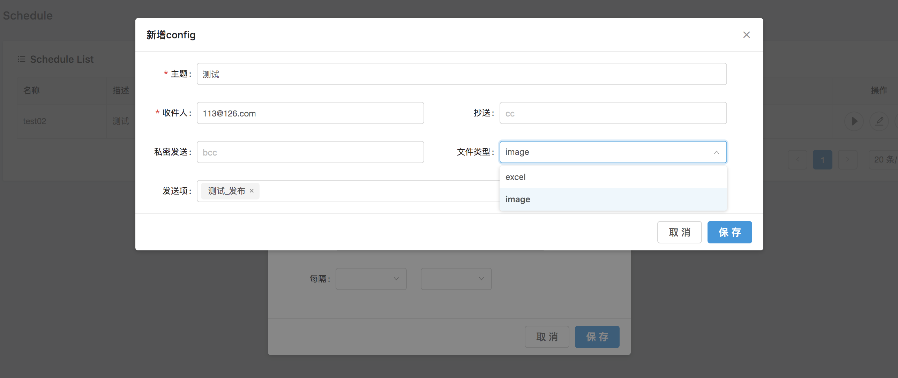
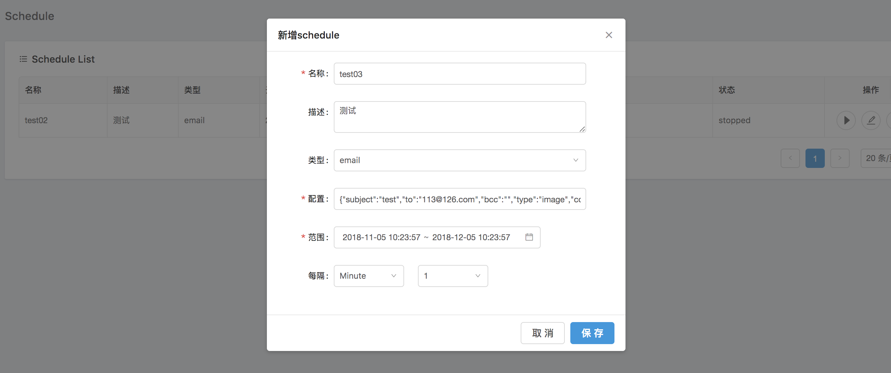

定时任务发送（Schedule）是指系统根据页面设置的时间规则和内容，在后台执行相应的任务，然后以一定的方式给指定用户定时发送通知，定时数据整合处理，定时与他人共享信息等。

注：在使用该功能时，确保邮件服务器已正确配置。

### 1 新增 Schedule

- 进入 Schedule 列表，点击右上角“新增”。

- 弹框，系统默认以邮件的形式发送。在“配置”的输入框内单击，在新弹出层内配置邮件主题、收件人、邮件内容等。支持发送 Dashboard 和 Display 两种数据应用的数据项。文件类型为 Image时，数据以截图形式发送，为 Excel时，以附件形式发送。

  

- 点击“保存”，回到新增 Schedule 弹层，设置发送时间范围和时间间隔，保存，定时任务创建成功。

  

### 2 启停/修改/删除 Schedule

支持启动/停止、编辑、删除 Schedule。启动时，系统根据你的配置定时发送内容。