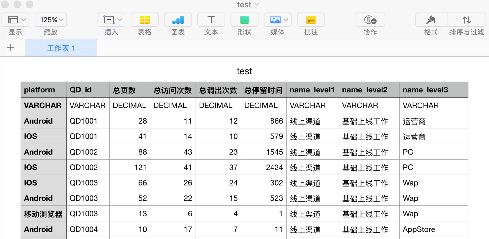

数据源管理（Source）主要是指数据源的导入和相关编辑工作。Davinci 0.3 目前支持通过 JDBC 连接的数据源，如：https://edp963.github.io/davinci/deployment.html#3-%E6%95%B0%E6%8D%AE%E6%BA%90%E9%85%8D%E7%BD%AE，也支持 CSV 数据文件上传。

### 1 新增数据源

- 进入 Source 列表，点击右上角“新增”。弹窗内输入数据源相关配置，点击“保存”。

  类型为 JDBC 时，一些不需要用户名和密码的特殊数据库，如 es，用户名和密码任意填写一个。

  类型为 CSV 时，上传的 CSV 文件解析后最终会存到数据库里，所以需要配置数据库连接，目前支持导入 mysql，“连接Url”应该填写到要导入的库。

  用户名、密码、连接 Url 分别为保存数据的数据库账号、密码、连接地址。

  可点击“点击测试”检查链接的可用性。

  

### 2 上传 CSV 数据文件

1. 准备 CSV 文件。

   模板第一行为保存在数据库的字段名称，建议使用英文；第二行为数据库的类型，使用大写字母；第三行之后为要导入的数据。如：

   

   注意：使用 Excel 保存 CSV 文件为 **UTF-8 格式**。

2. 点击“上传”按钮。

   

3. 输入数据源相关信息。此处输入的表名为保存在数据库内的表名，建议使用英文。点击“下一步”。

   

4. 上传文件。

   

### 3 修改、删除数据源

