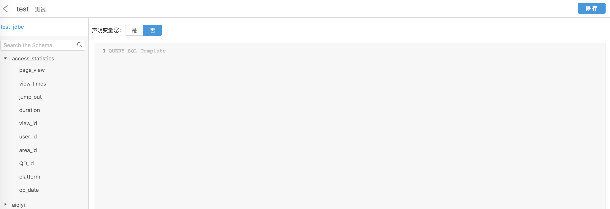
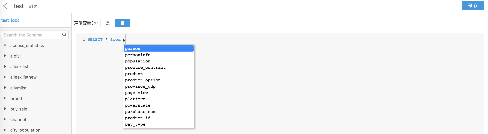
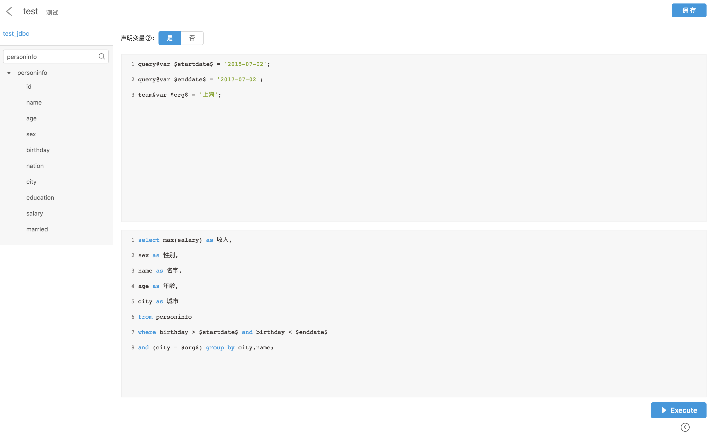
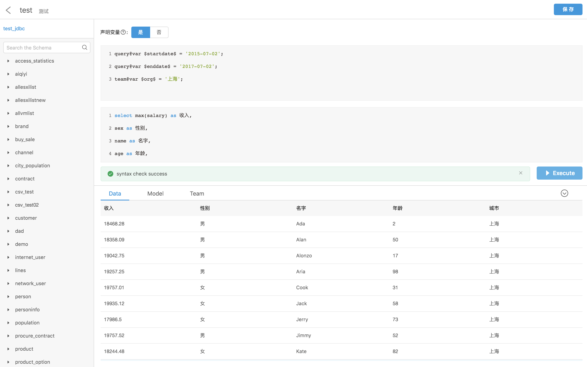
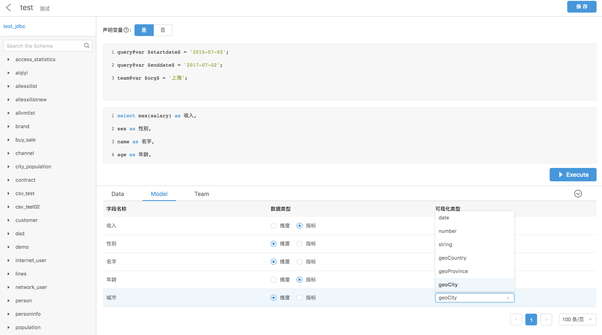
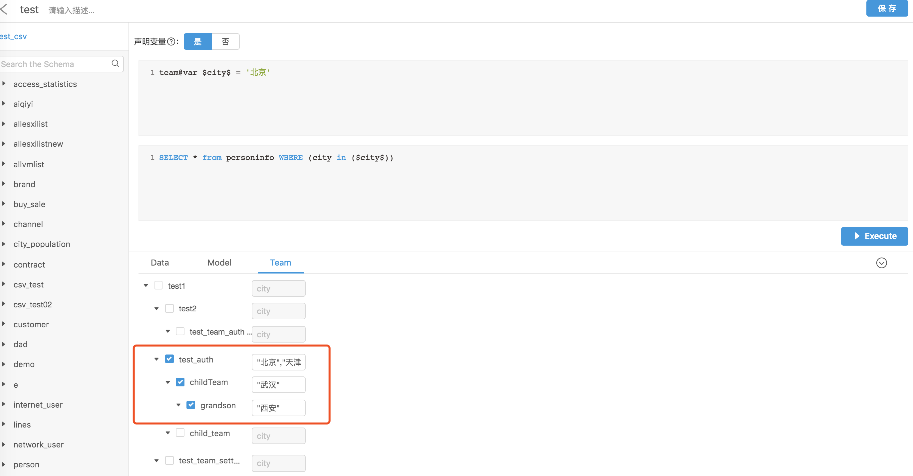

数据视图（View）是 Davinci 中非常重要的概念。所有的 SQL 逻辑都需要在这里创建，所有在图表上展示的数据都是通过这里的 SQL 获取，可视化建模和团队数据权限控制也在这里进行。

### 1 SQL 示例

- Davinci 0.3 支持简单的 SQL 模板，定义变量，实现动态 SQL。

  - 变量声明

    （注：Davinci 0.2 分组变量 `group@var` 变成了团队权限变量 `team@var`，功能类似）

    **查询变量定义**：`query@var $变量名称$`。必须有具体的初始值。可视化组件中会用到（稍后介绍）。

    **团队权限变量定义**：`team@var $变量名称$`。不同的团队传入不同的参数，实现行权限控制。

    ```
    query@var $startdate$ = '2015-07-02';
    query@var $enddate$ = '2017-07-02';
    team@var $org$ = '上海';
    ```

  - SQL 主体

    （注：Davinci 0.3 的 SQL 主体不再需要大括号包裹）

    ```
    select max(salary) as 收入,
    sex as 性别,
    name as 名字,
    age as 年龄,
    city as 城市
    from personinfo
    where birthday > $startdate$ and birthday < $enddate$ and (city = $org$)
    group by city,name;
    ```

- 支持简单的条件判断（如空值或布尔类型，不支持运算）

  - 变量声明

    ```
    query@var $x$ = '汉族'
    query@var $y$ = '回族'
    ```

  - SQL 主体

    ```
    $if(x)$
      ...
    $elseif(y)$
      ...
    $else$
      ...
    $endif$
    ```

    若 x 有值，则选择 if 分支的 sql；若 y 有值，选择 elseif 分支的 sql；否则，选择 else 分支的 sql。如：

    ```
    query@var $area$;
    ```

    ```
    select * from personinfo
    $if(area)$
    	where area in ($area$);
    $endif$
    	order by score desc limit 100;
    ```

### 2 配置视图

1. 进入 View 列表页，点击右上角“新增”，跳转到视图编辑页。

2. **选择数据源**。列表对应显示数据库表名和字段名。

   

3. **编辑 SQL。**

   SQL 编辑器支持语法、数据库表、字段提示和自动补全功能，支持定义 SQL 模版。编辑器分为变量声明和 SQL 主体两个部分，通过顶部的开关来切换。

   - 配置普通视图
   - 配置带有 query 查询变量或 team 团队权限变量定义的视图。

     

4. **执行 SQL。**测试 SQL 正确性，成功后可预览查询结果集。

   注意：“保存”前，**必须先点击“Execute”**执行 SQL。

   

5. **数据建模。**SQL 执行成功后，系统默认分配给每个字段一种数据类型和一种可视化类型，用户也可以配置它们，进行可视化建模。

   

6. **团队数据权限控制。**

   团队的数据权限根据 Team 树的层级呈递减关系，父级团队能访问子孙级团队的数据。通过配置 Team 实现行权限控制。这里需要结合“团队与权限管理”https://edp963.github.io/davinci/project_org_team_user_auth_guide.html#2-%E5%9B%A2%E9%98%9F%E4%B8%8E%E6%9D%83%E9%99%90%E7%AE%A1%E7%90%86章节一起配置。

   勾选团队，编辑参数，多条参数用英文逗号隔开。String 类型需要用单/双引号包裹。

   示例：Team 按下图配置后，通过该 View 创建 Widget，并添加到 Dashboard，“test_auth” 团队的普通成员登录 Davinci，并进入 Dashboard 查看创建的 Widget，能看到北京、天津、武汉和西安的数据；“childTeam”团队的 Member 能看到武汉和西安的数据；“grandson”的 Member 只能看到西安的数据。

   