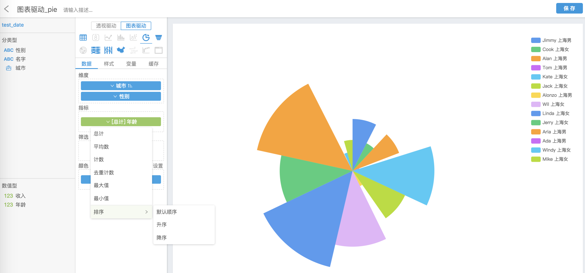
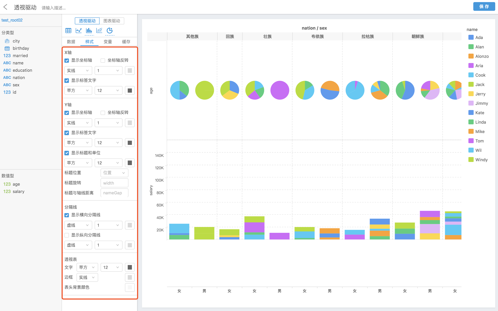
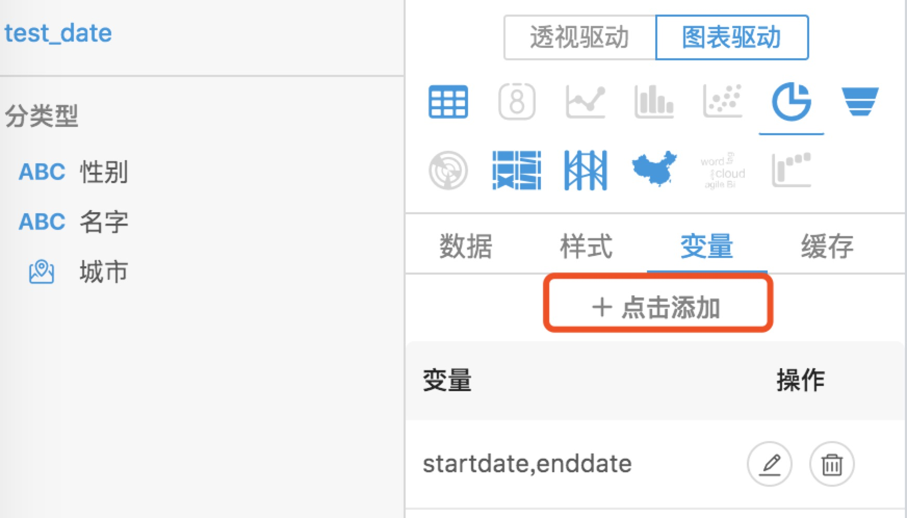
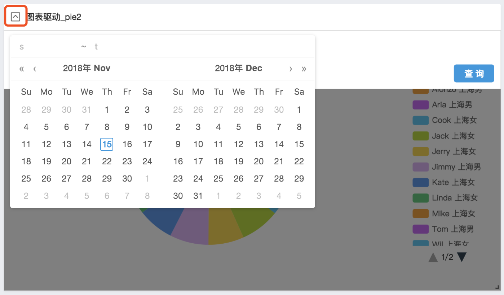
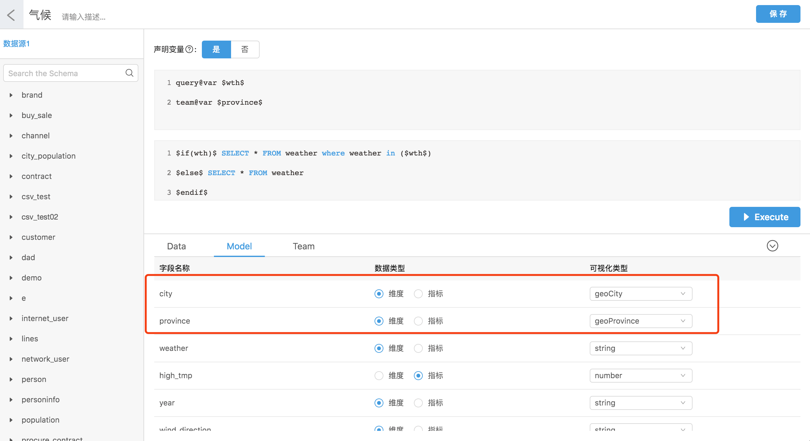
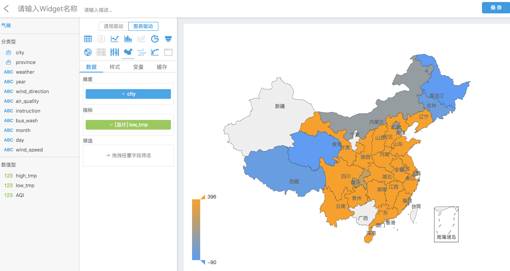
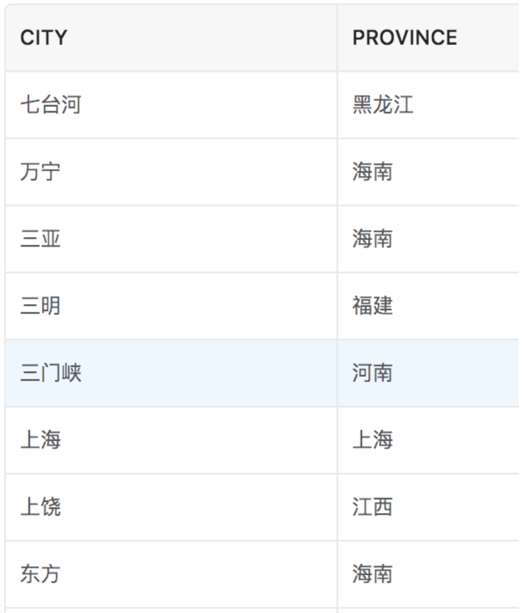
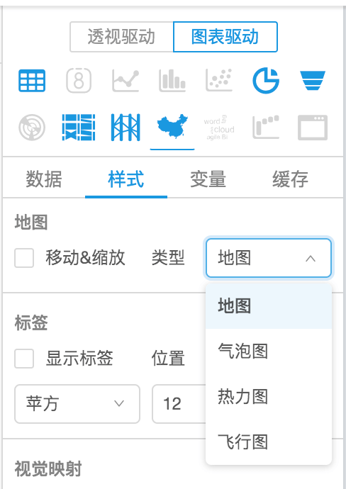

可视化组件（Widget）是 Davinci 中功能最强大也最复杂的部分。同一个数据视图可以被多个可视组件使用，并用不同的图形展现。Davinci 0.3 拥有全新的 Widget 编辑器体验，拖拽即可生成数据图表，将所选字段查询的结果集映射到图表上。目前编辑器支持两种数据驱动模式。

### 1 透视驱动&图表驱动

选择数据视图，分类型字段对应 View 中设置是维度的字段，数值型字段对应指标字段。当鼠标悬停在图形图标上，系统提示图形的配置要求，满足条件生成图形。

- **透视驱动**。在透视驱动模式下，图表的可视化逻辑基于用户拖拽配置生成数据透视表，通过将数据透视表中的指标项映射到坐标系中转换成图形。 

  透视驱动模式中一个图形对应一个指标，支持透视表转换到图表，支持行列转置，支持多图同轴对比，支持不同坐标系图表转换和对比等。

  

- **图表驱动**。与 Davinci 0.2 版本的可视化逻辑大体一致，用户拖拽配置的维度和指标服务于特定的图表类型，如柱状图、散点图、饼图、地图、桑基图、雷达图等，让你轻松打造出满意的可视化组件。

  图表驱动模式下单张图表内可以显示多个指标。用户可根据具体的场景选择不同的图表类型，比如当数据大小对比相近时，你可以选择饼图的南丁格尔玫瑰图，由于使用极坐标系，它会将数据的比例夸大，突出显示。

  

Widget 编辑器功能非常丰富，你还可以选择计算函数，指定筛选和颜色区分字段等等。

两种模式的图形都支持用户通过扩展方式将自己的配置项加到图表中，不同的图表对应不同的显示配置（两种模式还都支持外接 Redis 缓存哦，用户可以自主选择外接 Redis 来对查询结果数据进行缓存，在“缓存”栏里开启这项配置并填写缓存有效期）。

### 2 控制器

当你想在同一个图表上展示不同条件的结果集，你可以配置控制器。

**控制器配置**

1. 添加控制器组件 （关联 View 中定义的查询变量，`query@var` 标识的变量）。

2. 配置查询变量关联。

   

   

**控制器使用**

将 Widget 添加到 Dashboard 面板，点击下拉框。

### 3 特殊图表的配置

#### 3.1 地图

1. 地图需要先在 View 里指定数据模型的可视化类型：

   

2. 然后在 Widget 编辑界面将字段拖拽到维度栏里即可（视觉映射对应地区的指标值）：

   

   - 地图数据目前支持中国省份、城市以及区县：

     

   - 目前支持四种类型的地图：

     

     ​	